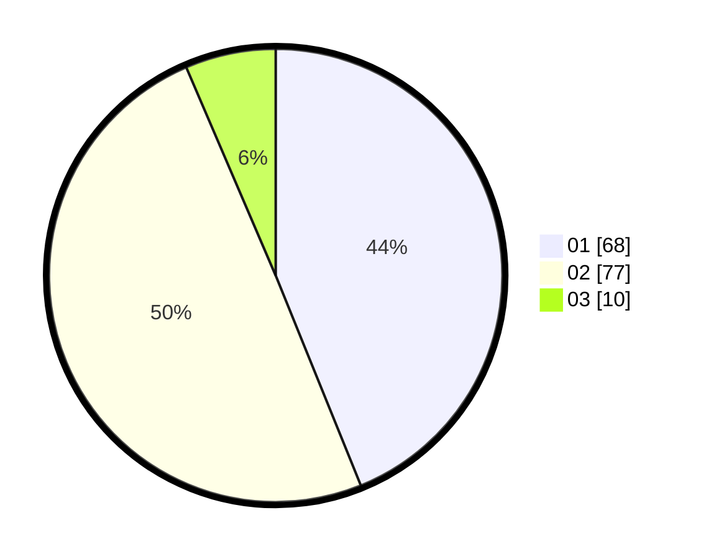

# Hasil

Hasil perolehan suara paslon dapat dilihat pada file paslon-01.txt, paslon-02.txt, dan paslon-03.txt.

Jika tidak ada, artinya data tersebut belum ada pada SIREKAP.

## Perolehan Suara

 * Paslon 01: **68**.
 * Paslon 02: **77**.
 * Paslon 03: **10**.

## Foto C Plano

https://sirekap-obj-formc.kpu.go.id/a208/pemilu/ppwp/31/72/03/10/03/3172031003013-20240214-155650--4cee1d1d-f3f6-498c-a79b-935fed265668.jpg

https://sirekap-obj-formc.kpu.go.id/a208/pemilu/ppwp/31/72/03/10/03/3172031003013-20240214-155528--2148bbd3-c323-4785-a9df-816c3416ae44.jpg

https://sirekap-obj-formc.kpu.go.id/a208/pemilu/ppwp/31/72/03/10/03/3172031003013-20240214-155538--550cc45a-9a5c-450f-b2e1-dae3e7b6ca34.jpg
