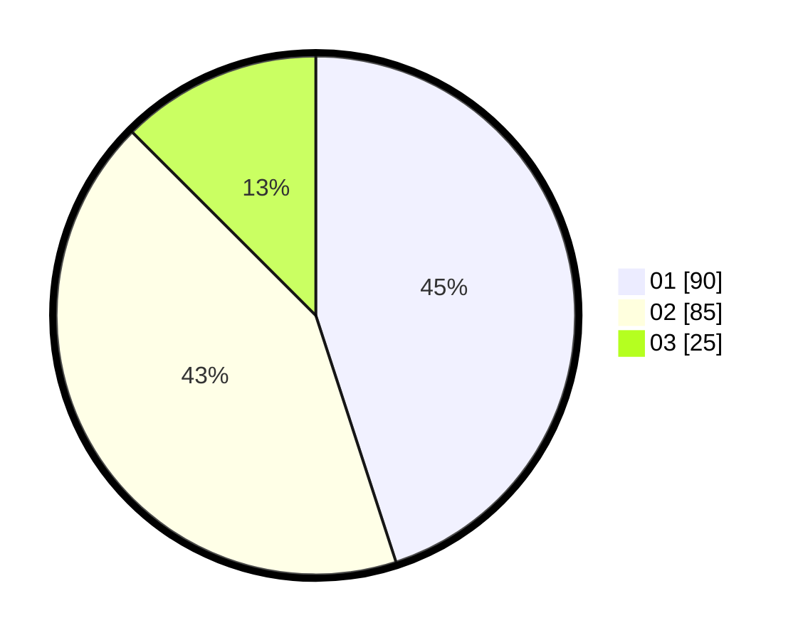

# Hasil

Hasil perolehan suara paslon dapat dilihat pada file paslon-01.txt, paslon-02.txt, dan paslon-03.txt.

Jika tidak ada, artinya data tersebut belum ada pada SIREKAP.

## Perolehan Suara

 * Paslon 01: **90**.
 * Paslon 02: **85**.
 * Paslon 03: **25**.

## Foto C Plano

https://sirekap-obj-formc.kpu.go.id/aec5/pemilu/ppwp/31/72/03/10/03/3172031003021-20240216-102551--ad43b254-ea6b-447e-8f17-a70daa9b8d87.jpg

https://sirekap-obj-formc.kpu.go.id/aec5/pemilu/ppwp/31/72/03/10/03/3172031003021-20240216-102938--837d8bea-2d10-406c-9c56-eb746b6628ed.jpg

https://sirekap-obj-formc.kpu.go.id/aec5/pemilu/ppwp/31/72/03/10/03/3172031003021-20240216-103314--9525cc4b-a19c-40e6-845d-c9f58a5dab23.jpg

## DATA PEMILIH TETAP

Jumlah pemilih dalam DPT: **288**.
 * L: **129**.
 * P: **159**.

## DATA PENGGUNA HAK PILIH

Jumlah pengguna hak pilih dalam DPT: **204**.
 * L: **85**.
 * P: **119**.

Jumlah pengguna hak pilih dalam DPTb: **6**.
 * L: **3**.
 * P: **3**.

Jumlah pengguna hak pilih dalam DPK: **0**.
 * L: **0**.
 * P: **0**.

Jumlah pengguna hak pilih: **210**.
 * L: **88**.
 * P: **122**.

## JUMLAH SUARA SAH DAN TIDAK SAH

JUMLAH SELURUH SUARA SAH: **201**.

JUMLAH SUARA TIDAK SAH: **9**.

JUMLAH SELURUH SUARA SAH DAN SUARA TIDAK SAH: **210**.
