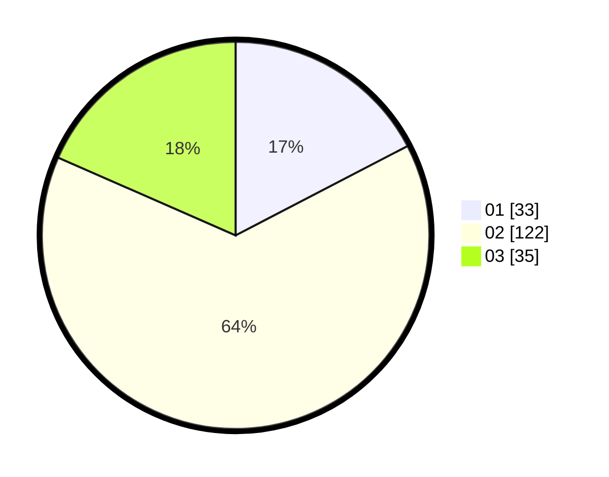

# Hasil

Hasil perolehan suara paslon dapat dilihat pada file paslon-01.txt, paslon-02.txt, dan paslon-03.txt.

Jika tidak ada, artinya data tersebut belum ada pada SIREKAP.

## Perolehan Suara

 * Paslon 01: **33**.
 * Paslon 02: **122**.
 * Paslon 03: **35**.

## Foto C Plano

https://sirekap-obj-formc.kpu.go.id/6e63/pemilu/ppwp/31/72/03/10/03/3172031003024-20240216-121159--ac0c56f1-552f-481f-bd7b-75bfa9f636de.jpg

https://sirekap-obj-formc.kpu.go.id/6e63/pemilu/ppwp/31/72/03/10/03/3172031003024-20240216-121249--c1725edc-4057-48f9-b93e-e1709ae137bc.jpg

https://sirekap-obj-formc.kpu.go.id/6e63/pemilu/ppwp/31/72/03/10/03/3172031003024-20240216-121344--432d5dac-3557-4a78-8a80-b3e0f92de1d8.jpg

## DATA PEMILIH TETAP

Jumlah pemilih dalam DPT: **284**.
 * L: **146**.
 * P: **138**.

## DATA PENGGUNA HAK PILIH

Jumlah pengguna hak pilih dalam DPT: **197**.
 * L: **99**.
 * P: **98**.

Jumlah pengguna hak pilih dalam DPTb: **0**.
 * L: **0**.
 * P: **0**.

Jumlah pengguna hak pilih dalam DPK: **0**.
 * L: **0**.
 * P: **0**.

Jumlah pengguna hak pilih: **197**.
 * L: **99**.
 * P: **98**.

## JUMLAH SUARA SAH DAN TIDAK SAH

JUMLAH SELURUH SUARA SAH: **190**.

JUMLAH SUARA TIDAK SAH: **7**.

JUMLAH SELURUH SUARA SAH DAN SUARA TIDAK SAH: **197**.
