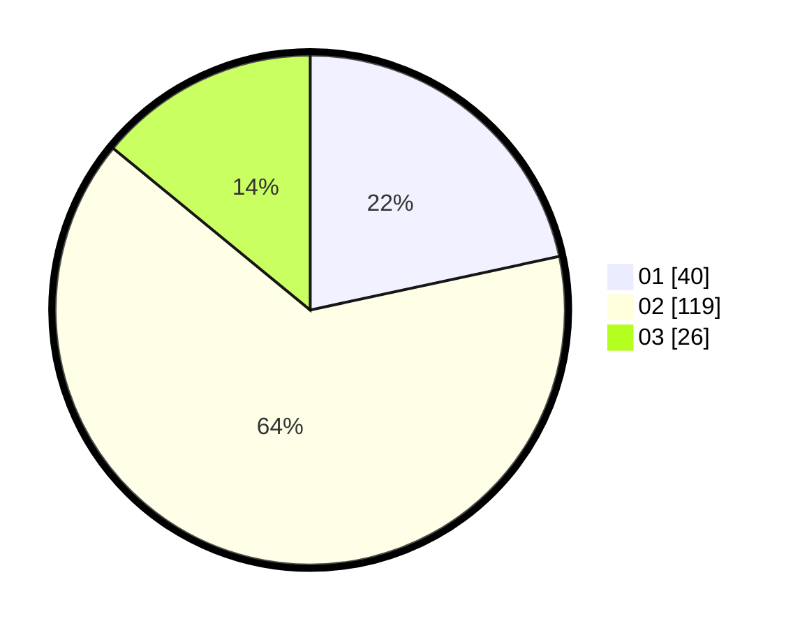

# Hasil

Hasil perolehan suara paslon dapat dilihat pada file paslon-01.txt, paslon-02.txt, dan paslon-03.txt.

Jika tidak ada, artinya data tersebut belum ada pada SIREKAP.

## Perolehan Suara

 * Paslon 01: **40**.
 * Paslon 02: **119**.
 * Paslon 03: **26**.

## Foto C Plano

https://sirekap-obj-formc.kpu.go.id/c0b4/pemilu/ppwp/31/72/03/10/03/3172031003027-20240215-011724--6a85602b-c238-464c-924d-fff88ce97ebd.jpg

https://sirekap-obj-formc.kpu.go.id/c0b4/pemilu/ppwp/31/72/03/10/03/3172031003027-20240215-011755--9a3a1acf-e13c-43d8-900a-ffc7dd2c9a6d.jpg
