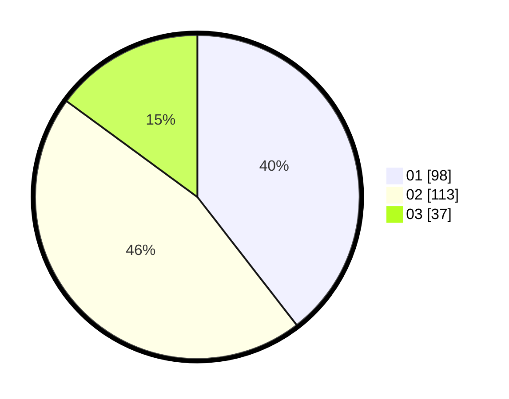

# Hasil

Hasil perolehan suara paslon dapat dilihat pada file paslon-01.txt, paslon-02.txt, dan paslon-03.txt.

Jika tidak ada, artinya data tersebut belum ada pada SIREKAP.

## Perolehan Suara

 * Paslon 01: **98**.
 * Paslon 02: **113**.
 * Paslon 03: **37**.

## Foto C Plano

https://sirekap-obj-formc.kpu.go.id/37ca/pemilu/ppwp/31/72/03/10/03/3172031003030-20240214-193019--bf829fa5-8c09-4b6f-ab08-4b3bb270cce1.jpg

https://sirekap-obj-formc.kpu.go.id/37ca/pemilu/ppwp/31/72/03/10/03/3172031003030-20240214-193519--5fbccc4c-593b-4e14-8625-8e1d37cf3d5d.jpg

https://sirekap-obj-formc.kpu.go.id/37ca/pemilu/ppwp/31/72/03/10/03/3172031003030-20240214-193529--2bdc418a-c28a-44ef-a43e-9480f5e5ba0a.jpg
