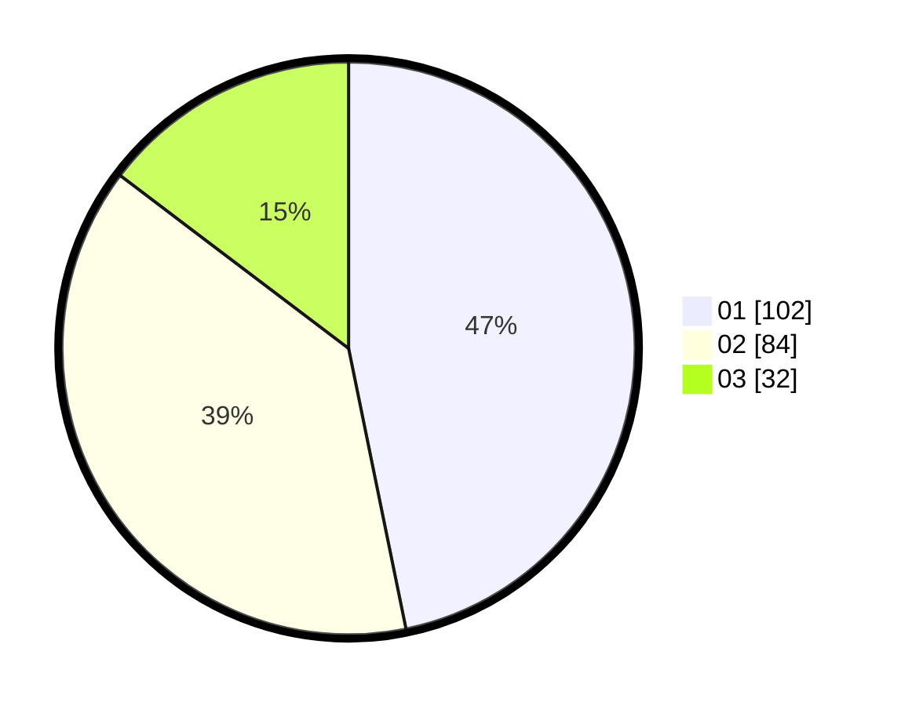

# Hasil

Hasil perolehan suara paslon dapat dilihat pada file paslon-01.txt, paslon-02.txt, dan paslon-03.txt.

Jika tidak ada, artinya data tersebut belum ada pada SIREKAP.

## Perolehan Suara

 * Paslon 01: **102**.
 * Paslon 02: **84**.
 * Paslon 03: **32**.

## Foto C Plano

https://sirekap-obj-formc.kpu.go.id/6d60/pemilu/ppwp/31/72/03/10/03/3172031003040-20240214-194128--0eaa8a01-5258-48c5-985a-418da125a604.jpg

https://sirekap-obj-formc.kpu.go.id/6d60/pemilu/ppwp/31/72/03/10/03/3172031003040-20240214-211452--7a679dc4-08f7-43e8-9720-e863554fb939.jpg

https://sirekap-obj-formc.kpu.go.id/6d60/pemilu/ppwp/31/72/03/10/03/3172031003040-20240214-211804--7dc7d75f-6c18-4038-8335-4dd1e28254a3.jpg

## DATA PEMILIH TETAP

Jumlah pemilih dalam DPT: **291**.
 * L: **152**.
 * P: **139**.

## DATA PENGGUNA HAK PILIH

Jumlah pengguna hak pilih dalam DPT: **216**.
 * L: **102**.
 * P: **114**.

Jumlah pengguna hak pilih dalam DPTb: **5**.
 * L: **3**.
 * P: **2**.

Jumlah pengguna hak pilih dalam DPK: **0**.
 * L: **0**.
 * P: **0**.

Jumlah pengguna hak pilih: **221**.
 * L: **105**.
 * P: **116**.

## JUMLAH SUARA SAH DAN TIDAK SAH

JUMLAH SELURUH SUARA SAH: **218**.

JUMLAH SUARA TIDAK SAH: **3**.

JUMLAH SELURUH SUARA SAH DAN SUARA TIDAK SAH: **221**.
