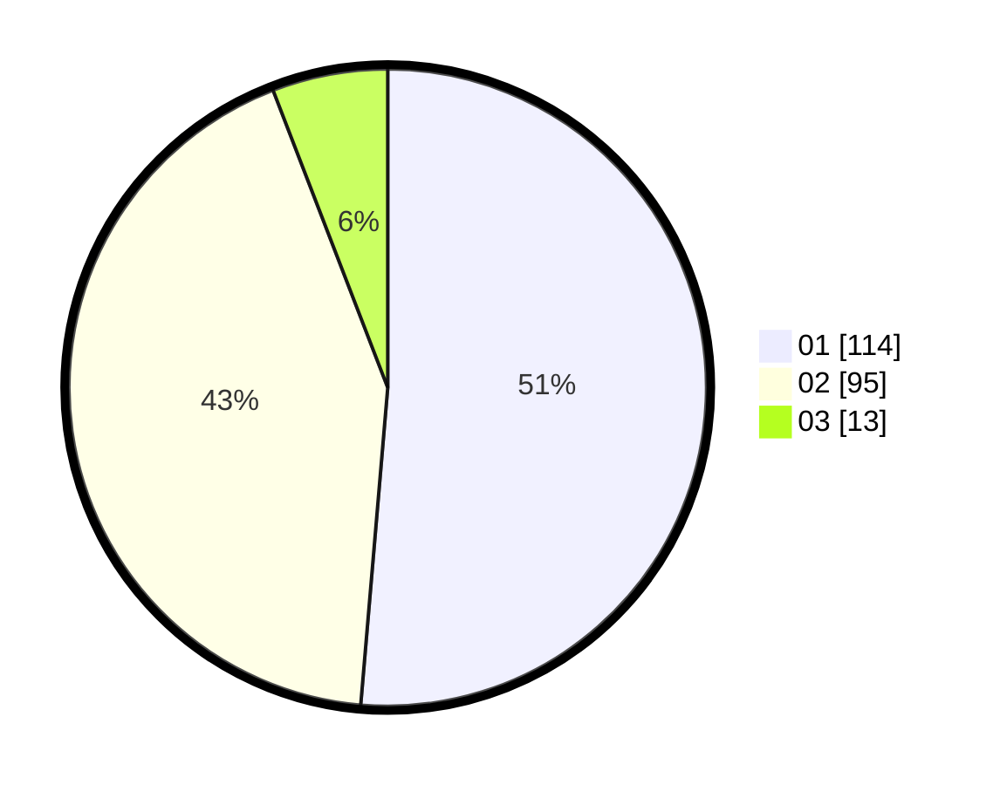

# Hasil

Hasil perolehan suara paslon dapat dilihat pada file paslon-01.txt, paslon-02.txt, dan paslon-03.txt.

Jika tidak ada, artinya data tersebut belum ada pada SIREKAP.

## Perolehan Suara

 * Paslon 01: **114**.
 * Paslon 02: **95**.
 * Paslon 03: **13**.

## Foto C Plano

https://sirekap-obj-formc.kpu.go.id/e2e1/pemilu/ppwp/31/72/03/10/03/3172031003045-20240215-130101--4b488bcf-82a0-4fcd-aaf7-7f022b9d34ff.jpg

https://sirekap-obj-formc.kpu.go.id/e2e1/pemilu/ppwp/31/72/03/10/03/3172031003045-20240215-211728--7613d40d-5bac-4ee3-a455-fb16df8024df.jpg

https://sirekap-obj-formc.kpu.go.id/e2e1/pemilu/ppwp/31/72/03/10/03/3172031003045-20240215-130351--fc6da31e-8936-4652-8acf-11b6ca5ae014.jpg
