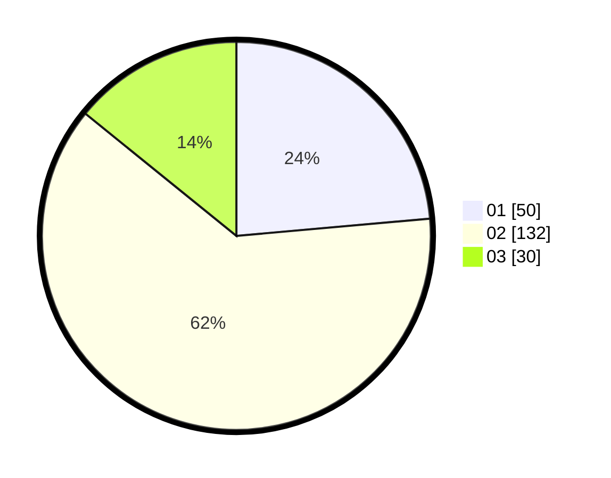

# Hasil

Hasil perolehan suara paslon dapat dilihat pada file paslon-01.txt, paslon-02.txt, dan paslon-03.txt.

Jika tidak ada, artinya data tersebut belum ada pada SIREKAP.

## Perolehan Suara

 * Paslon 01: **50**.
 * Paslon 02: **132**.
 * Paslon 03: **30**.

## Foto C Plano

https://sirekap-obj-formc.kpu.go.id/6089/pemilu/ppwp/31/72/03/10/03/3172031003055-20240216-234324--3dfd33e8-689a-466c-94ab-29cfa55db4ea.jpg

https://sirekap-obj-formc.kpu.go.id/6089/pemilu/ppwp/31/72/03/10/03/3172031003055-20240217-000857--82924098-1ed9-4317-937a-c59622d6ae86.jpg

https://sirekap-obj-formc.kpu.go.id/6089/pemilu/ppwp/31/72/03/10/03/3172031003055-20240217-000038--8cf8a9b4-259b-4c07-9303-dcfa2a5fbc83.jpg

## DATA PEMILIH TETAP

Jumlah pemilih dalam DPT: **292**.
 * L: **152**.
 * P: **140**.

## DATA PENGGUNA HAK PILIH

Jumlah pengguna hak pilih dalam DPT: **207**.
 * L: **101**.
 * P: **106**.

Jumlah pengguna hak pilih dalam DPTb: **4**.
 * L: **1**.
 * P: **3**.

Jumlah pengguna hak pilih dalam DPK: **2**.
 * L: **2**.
 * P: **0**.

Jumlah pengguna hak pilih: **213**.
 * L: **104**.
 * P: **109**.

## JUMLAH SUARA SAH DAN TIDAK SAH

JUMLAH SELURUH SUARA SAH: **212**.

JUMLAH SUARA TIDAK SAH: **1**.

JUMLAH SELURUH SUARA SAH DAN SUARA TIDAK SAH: **213**.
