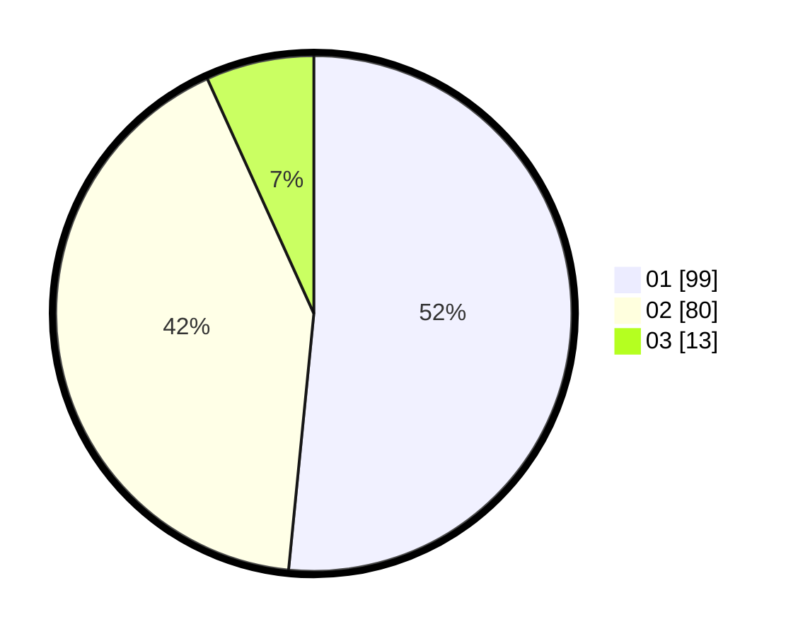

# Hasil

Hasil perolehan suara paslon dapat dilihat pada file paslon-01.txt, paslon-02.txt, dan paslon-03.txt.

Jika tidak ada, artinya data tersebut belum ada pada SIREKAP.

## Perolehan Suara

 * Paslon 01: **99**.
 * Paslon 02: **80**.
 * Paslon 03: **13**.

## Foto C Plano

https://sirekap-obj-formc.kpu.go.id/39cc/pemilu/ppwp/31/72/03/10/03/3172031003058-20240215-233540--7077d537-c99b-4795-b78a-f1afcaedff69.jpg

https://sirekap-obj-formc.kpu.go.id/39cc/pemilu/ppwp/31/72/03/10/03/3172031003058-20240215-233738--3f9be42c-111d-461f-bce4-0623e02f5fb2.jpg

https://sirekap-obj-formc.kpu.go.id/39cc/pemilu/ppwp/31/72/03/10/03/3172031003058-20240215-233949--5ad30a45-f0e7-446f-8f85-cfdcee48e84b.jpg
