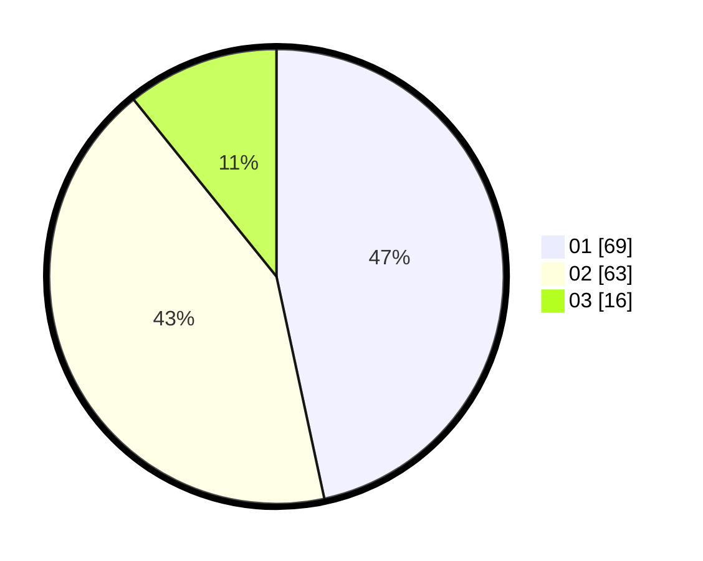

# Hasil

Hasil perolehan suara paslon dapat dilihat pada file paslon-01.txt, paslon-02.txt, dan paslon-03.txt.

Jika tidak ada, artinya data tersebut belum ada pada SIREKAP.

## Perolehan Suara

 * Paslon 01: **69**.
 * Paslon 02: **63**.
 * Paslon 03: **16**.

## Foto C Plano

https://sirekap-obj-formc.kpu.go.id/fb02/pemilu/ppwp/31/72/03/10/03/3172031003087-20240214-214809--cdb6551f-dfce-4c5d-8738-1e9d278b815a.jpg

https://sirekap-obj-formc.kpu.go.id/fb02/pemilu/ppwp/31/72/03/10/03/3172031003087-20240214-214819--4961665e-3049-4a65-aada-4b5f4b7fa3bd.jpg

https://sirekap-obj-formc.kpu.go.id/fb02/pemilu/ppwp/31/72/03/10/03/3172031003087-20240214-214822--845ab80e-711f-4e97-a292-6fa6f04bbef9.jpg

## DATA PEMILIH TETAP

Jumlah pemilih dalam DPT: **208**.
 * L: **101**.
 * P: **107**.

## DATA PENGGUNA HAK PILIH

Jumlah pengguna hak pilih dalam DPT: **150**.
 * L: **68**.
 * P: **82**.

Jumlah pengguna hak pilih dalam DPTb: **0**.
 * L: **0**.
 * P: **0**.

Jumlah pengguna hak pilih dalam DPK: **1**.
 * L: **0**.
 * P: **1**.

Jumlah pengguna hak pilih: **151**.
 * L: **68**.
 * P: **83**.

## JUMLAH SUARA SAH DAN TIDAK SAH

JUMLAH SELURUH SUARA SAH: **148**.

JUMLAH SUARA TIDAK SAH: **3**.

JUMLAH SELURUH SUARA SAH DAN SUARA TIDAK SAH: **131**.
