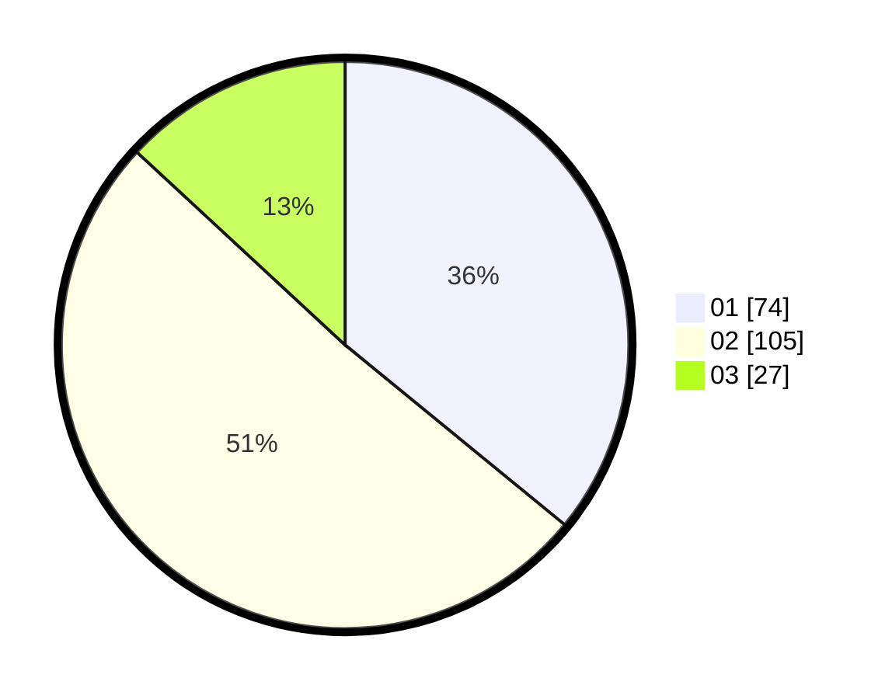

# Hasil

Hasil perolehan suara paslon dapat dilihat pada file paslon-01.txt, paslon-02.txt, dan paslon-03.txt.

Jika tidak ada, artinya data tersebut belum ada pada SIREKAP.

## Perolehan Suara

 * Paslon 01: **74**.
 * Paslon 02: **105**.
 * Paslon 03: **27**.

## Foto C Plano

https://sirekap-obj-formc.kpu.go.id/5565/pemilu/ppwp/31/72/03/10/03/3172031003102-20240215-152729--b3a3e914-bbab-47ce-851c-e557910af89b.jpg

https://sirekap-obj-formc.kpu.go.id/5565/pemilu/ppwp/31/72/03/10/03/3172031003102-20240215-152758--4f7a8b38-ee66-45fb-b8cf-d4991ec53aff.jpg

https://sirekap-obj-formc.kpu.go.id/5565/pemilu/ppwp/31/72/03/10/03/3172031003102-20240215-152747--5d1a1055-f580-49da-bc15-2dcbb1935fca.jpg

## DATA PEMILIH TETAP

Jumlah pemilih dalam DPT: **276**.
 * L: **143**.
 * P: **133**.

## DATA PENGGUNA HAK PILIH

Jumlah pengguna hak pilih dalam DPT: **210**.
 * L: **108**.
 * P: **102**.

Jumlah pengguna hak pilih dalam DPTb: **0**.
 * L: **0**.
 * P: **0**.

Jumlah pengguna hak pilih dalam DPK: **1**.
 * L: **1**.
 * P: **0**.

Jumlah pengguna hak pilih: **211**.
 * L: **109**.
 * P: **102**.

## JUMLAH SUARA SAH DAN TIDAK SAH

JUMLAH SELURUH SUARA SAH: **206**.

JUMLAH SUARA TIDAK SAH: **5**.

JUMLAH SELURUH SUARA SAH DAN SUARA TIDAK SAH: **211**.
