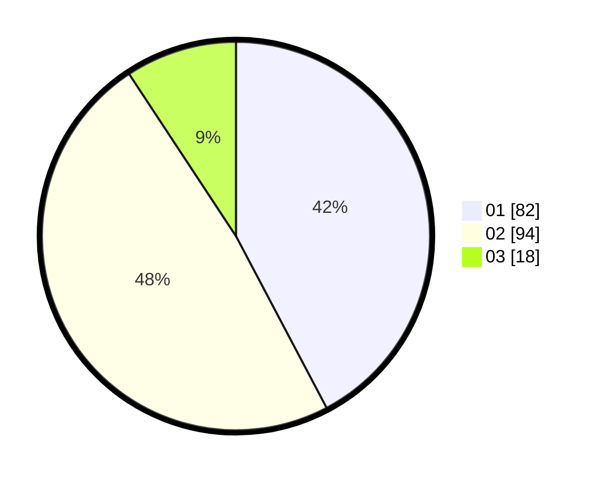

# Hasil

Hasil perolehan suara paslon dapat dilihat pada file paslon-01.txt, paslon-02.txt, dan paslon-03.txt.

Jika tidak ada, artinya data tersebut belum ada pada SIREKAP.

## Perolehan Suara

 * Paslon 01: **82**.
 * Paslon 02: **94**.
 * Paslon 03: **18**.

## Foto C Plano

https://sirekap-obj-formc.kpu.go.id/61ec/pemilu/ppwp/31/72/03/10/03/3172031003103-20240214-194325--f696a21b-2774-443f-b182-06cb87008eda.jpg

https://sirekap-obj-formc.kpu.go.id/61ec/pemilu/ppwp/31/72/03/10/03/3172031003103-20240214-155650--e7f2e76c-9e61-4b97-b341-69bdf6b989ee.jpg

https://sirekap-obj-formc.kpu.go.id/61ec/pemilu/ppwp/31/72/03/10/03/3172031003103-20240214-155656--78d10882-7d6a-4bd8-bffd-606fc3ec1d54.jpg
