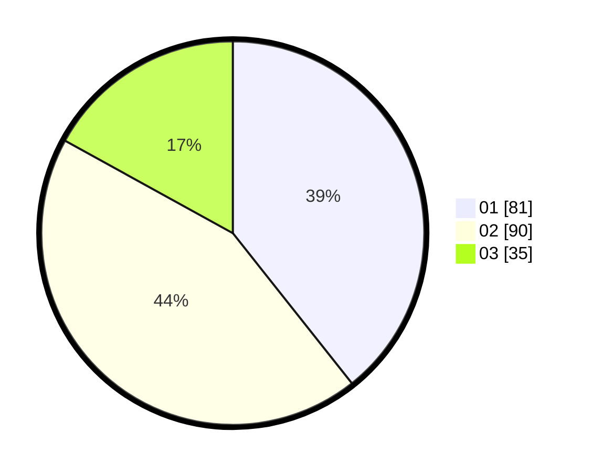

# Hasil

Hasil perolehan suara paslon dapat dilihat pada file paslon-01.txt, paslon-02.txt, dan paslon-03.txt.

Jika tidak ada, artinya data tersebut belum ada pada SIREKAP.

## Perolehan Suara

 * Paslon 01: **81**.
 * Paslon 02: **90**.
 * Paslon 03: **35**.

## Foto C Plano

https://sirekap-obj-formc.kpu.go.id/eb49/pemilu/ppwp/31/72/03/10/03/3172031003118-20240214-211559--608467b0-bedb-4ec4-92d4-1f208a3a6e56.jpg

https://sirekap-obj-formc.kpu.go.id/eb49/pemilu/ppwp/31/72/03/10/03/3172031003118-20240214-211812--5a7b5f95-c235-4f22-9b83-e47b91b9370d.jpg

https://sirekap-obj-formc.kpu.go.id/eb49/pemilu/ppwp/31/72/03/10/03/3172031003118-20240214-211845--9d25e248-110c-4abd-bc05-fd0ab3a508f1.jpg

## DATA PEMILIH TETAP

Jumlah pemilih dalam DPT: **204**.
 * L: **101**.
 * P: **103**.

## DATA PENGGUNA HAK PILIH

Jumlah pengguna hak pilih dalam DPT: **204**.
 * L: **101**.
 * P: **103**.

Jumlah pengguna hak pilih dalam DPTb: **0**.
 * L: **0**.
 * P: **0**.

Jumlah pengguna hak pilih dalam DPK: **2**.
 * L: **1**.
 * P: **1**.

Jumlah pengguna hak pilih: **206**.
 * L: **102**.
 * P: **104**.

## JUMLAH SUARA SAH DAN TIDAK SAH

JUMLAH SELURUH SUARA SAH: **206**.

JUMLAH SUARA TIDAK SAH: **0**.

JUMLAH SELURUH SUARA SAH DAN SUARA TIDAK SAH: **206**.
