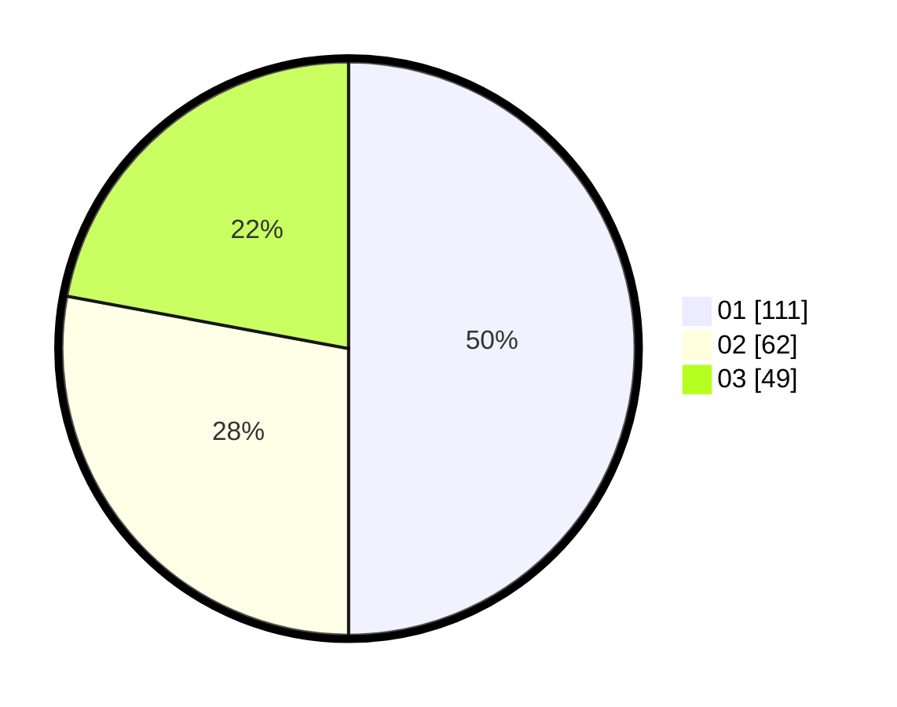

# Hasil

Hasil perolehan suara paslon dapat dilihat pada file paslon-01.txt, paslon-02.txt, dan paslon-03.txt.

Jika tidak ada, artinya data tersebut belum ada pada SIREKAP.

## Perolehan Suara

 * Paslon 01: **111**.
 * Paslon 02: **62**.
 * Paslon 03: **49**.

## Foto C Plano

https://sirekap-obj-formc.kpu.go.id/c841/pemilu/ppwp/31/72/03/10/03/3172031003119-20240214-192040--55e6db69-ede4-4d84-a072-dcde7b695315.jpg

https://sirekap-obj-formc.kpu.go.id/c841/pemilu/ppwp/31/72/03/10/03/3172031003119-20240214-192151--d75ff983-e493-466b-b8f2-82d943d48b1e.jpg

https://sirekap-obj-formc.kpu.go.id/c841/pemilu/ppwp/31/72/03/10/03/3172031003119-20240214-193554--49418535-8059-47e7-8902-9e6a1f925cef.jpg
