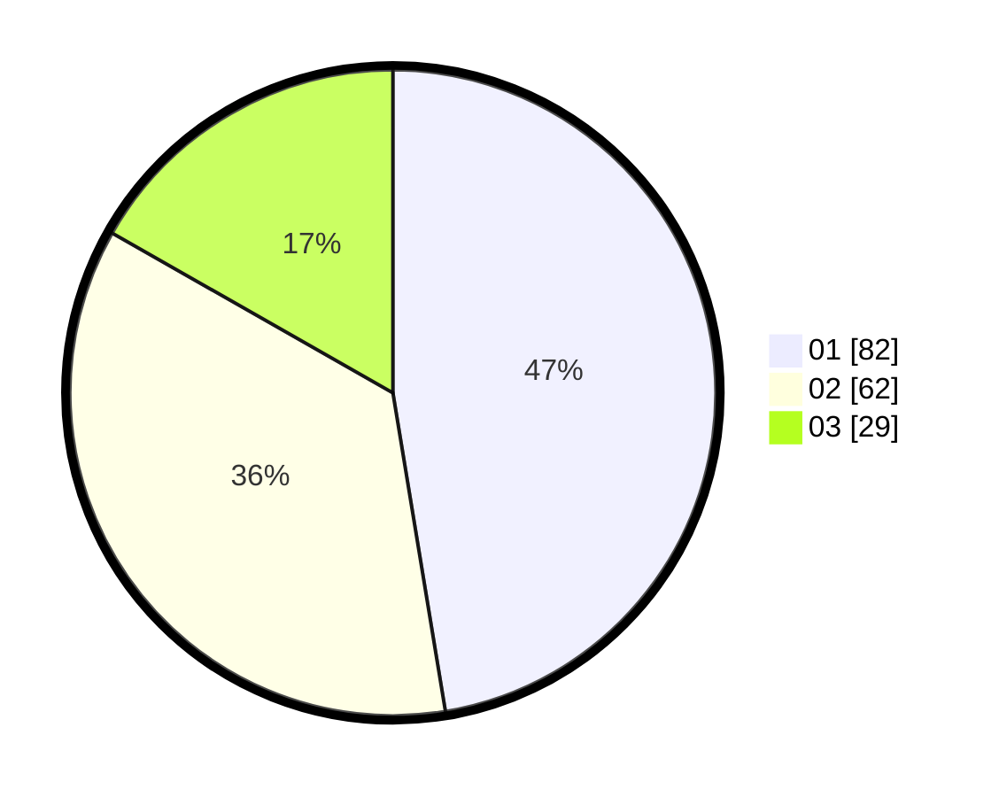

# Hasil

Hasil perolehan suara paslon dapat dilihat pada file paslon-01.txt, paslon-02.txt, dan paslon-03.txt.

Jika tidak ada, artinya data tersebut belum ada pada SIREKAP.

## Perolehan Suara

 * Paslon 01: **82**.
 * Paslon 02: **62**.
 * Paslon 03: **29**.

## Foto C Plano

https://sirekap-obj-formc.kpu.go.id/6635/pemilu/ppwp/31/72/03/10/03/3172031003121-20240216-142909--1dc43f58-b858-4084-a9de-0774cc738aa7.jpg

https://sirekap-obj-formc.kpu.go.id/6635/pemilu/ppwp/31/72/03/10/03/3172031003121-20240216-142910--ccec8bce-032d-4cf3-9cd0-01aa88a629ef.jpg

https://sirekap-obj-formc.kpu.go.id/6635/pemilu/ppwp/31/72/03/10/03/3172031003121-20240216-142909--14df618b-2554-421e-8ff1-e43c3bc4b25e.jpg

## DATA PEMILIH TETAP

Jumlah pemilih dalam DPT: **218**.
 * L: **103**.
 * P: **115**.

## DATA PENGGUNA HAK PILIH

Jumlah pengguna hak pilih dalam DPT: **173**.
 * L: **77**.
 * P: **96**.

Jumlah pengguna hak pilih dalam DPTb: **1**.
 * L: **0**.
 * P: **1**.

Jumlah pengguna hak pilih dalam DPK: **2**.
 * L: **1**.
 * P: **1**.

Jumlah pengguna hak pilih: **176**.
 * L: **78**.
 * P: **98**.

## JUMLAH SUARA SAH DAN TIDAK SAH

JUMLAH SELURUH SUARA SAH: **173**.

JUMLAH SUARA TIDAK SAH: **3**.

JUMLAH SELURUH SUARA SAH DAN SUARA TIDAK SAH: **176**.
