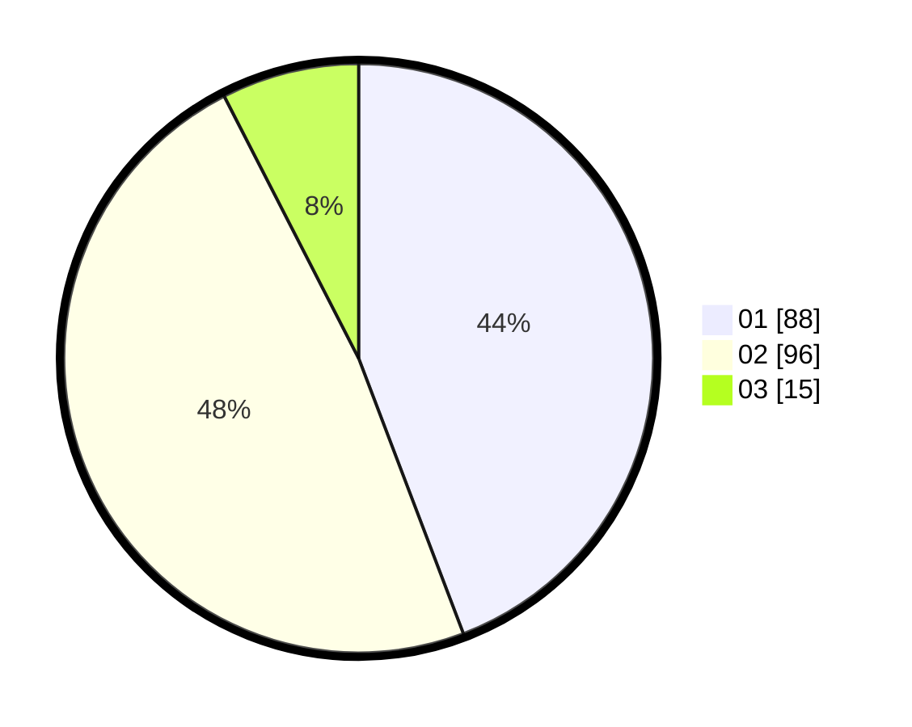

# Hasil

Hasil perolehan suara paslon dapat dilihat pada file paslon-01.txt, paslon-02.txt, dan paslon-03.txt.

Jika tidak ada, artinya data tersebut belum ada pada SIREKAP.

## Perolehan Suara

 * Paslon 01: **88**.
 * Paslon 02: **96**.
 * Paslon 03: **15**.

## Foto C Plano

https://sirekap-obj-formc.kpu.go.id/9b60/pemilu/ppwp/31/72/03/10/03/3172031003157-20240216-000607--eeb9ff1b-3730-4eb5-aa7c-6eb6fe4b8d41.jpg

https://sirekap-obj-formc.kpu.go.id/9b60/pemilu/ppwp/31/72/03/10/03/3172031003157-20240216-000609--986e6ea2-7322-466b-96b2-4caec29bdb5b.jpg

https://sirekap-obj-formc.kpu.go.id/9b60/pemilu/ppwp/31/72/03/10/03/3172031003157-20240216-000609--d7236eea-0b75-4ee4-a9b2-73af96bbe9ec.jpg

## DATA PEMILIH TETAP

Jumlah pemilih dalam DPT: **249**.
 * L: **127**.
 * P: **122**.

## DATA PENGGUNA HAK PILIH

Jumlah pengguna hak pilih dalam DPT: **189**.
 * L: **89**.
 * P: **100**.

Jumlah pengguna hak pilih dalam DPTb: **0**.
 * L: **0**.
 * P: **0**.

Jumlah pengguna hak pilih dalam DPK: **13**.
 * L: **6**.
 * P: **7**.

Jumlah pengguna hak pilih: **202**.
 * L: **95**.
 * P: **107**.

## JUMLAH SUARA SAH DAN TIDAK SAH

JUMLAH SELURUH SUARA SAH: **199**.

JUMLAH SUARA TIDAK SAH: **3**.

JUMLAH SELURUH SUARA SAH DAN SUARA TIDAK SAH: **202**.
