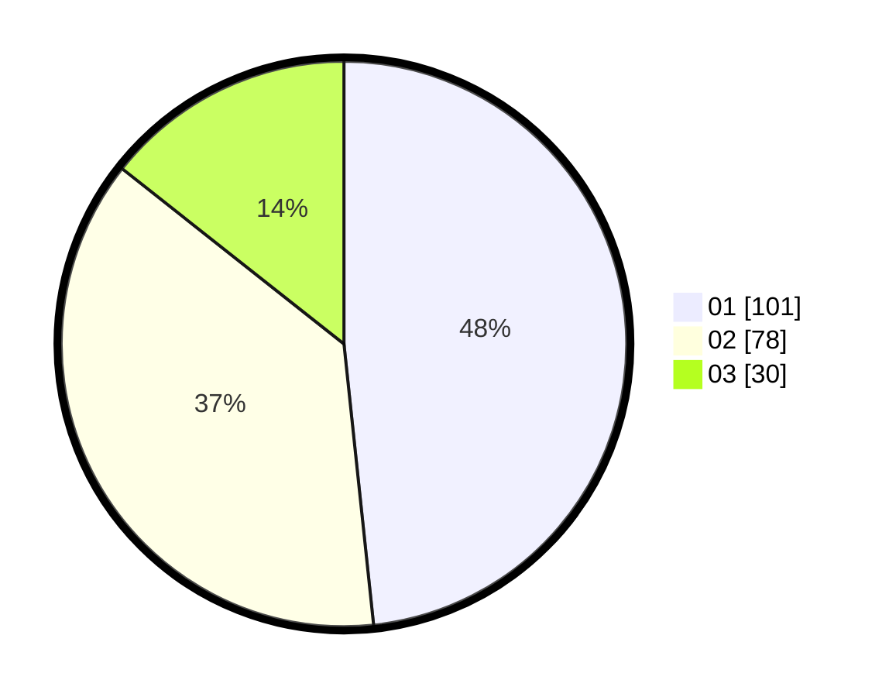

# Hasil

Hasil perolehan suara paslon dapat dilihat pada file paslon-01.txt, paslon-02.txt, dan paslon-03.txt.

Jika tidak ada, artinya data tersebut belum ada pada SIREKAP.

## Perolehan Suara

 * Paslon 01: **101**.
 * Paslon 02: **78**.
 * Paslon 03: **30**.

## Foto C Plano

https://sirekap-obj-formc.kpu.go.id/c392/pemilu/ppwp/31/72/03/10/03/3172031003167-20240214-215330--d392ed8a-d029-4d21-8217-6a3b6fc0d919.jpg

https://sirekap-obj-formc.kpu.go.id/c392/pemilu/ppwp/31/72/03/10/03/3172031003167-20240214-215920--79bf70ad-820d-4dd7-aed7-8f59a8b029e9.jpg

https://sirekap-obj-formc.kpu.go.id/c392/pemilu/ppwp/31/72/03/10/03/3172031003167-20240214-220140--cf5f8c49-e7bd-419c-948b-21c2d0c9eb41.jpg
