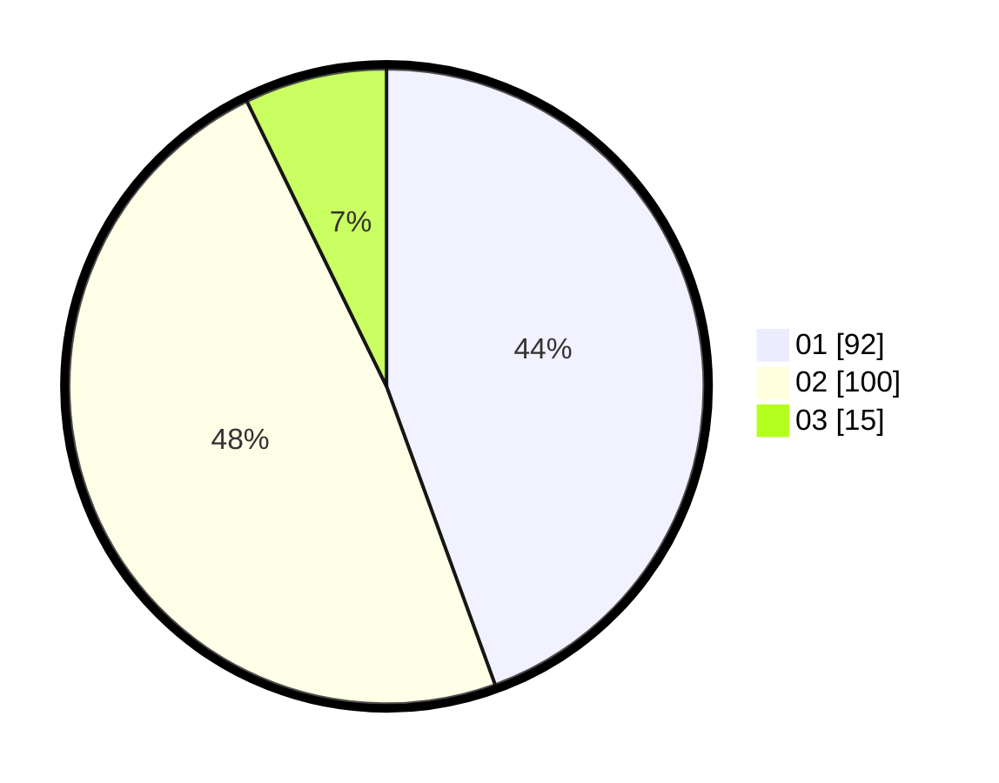

# Hasil

Hasil perolehan suara paslon dapat dilihat pada file paslon-01.txt, paslon-02.txt, dan paslon-03.txt.

Jika tidak ada, artinya data tersebut belum ada pada SIREKAP.

## Perolehan Suara

 * Paslon 01: **92**.
 * Paslon 02: **100**.
 * Paslon 03: **15**.

## Foto C Plano

https://sirekap-obj-formc.kpu.go.id/5b4b/pemilu/ppwp/31/72/03/10/04/3172031004006-20240215-225208--18055ab5-b042-4775-bb3e-ee3d6317fe66.jpg

https://sirekap-obj-formc.kpu.go.id/5b4b/pemilu/ppwp/31/72/03/10/04/3172031004006-20240215-225210--ff0eda6e-0941-48dc-a9d8-b8b4cb1b79f5.jpg

https://sirekap-obj-formc.kpu.go.id/5b4b/pemilu/ppwp/31/72/03/10/04/3172031004006-20240215-225209--58027b9b-0fb9-4854-be44-d60c6e4d7ff0.jpg

## DATA PEMILIH TETAP

Jumlah pemilih dalam DPT: **263**.
 * L: **141**.
 * P: **122**.

## DATA PENGGUNA HAK PILIH

Jumlah pengguna hak pilih dalam DPT: **212**.
 * L: **109**.
 * P: **103**.

Jumlah pengguna hak pilih dalam DPTb: **0**.
 * L: **0**.
 * P: **0**.

Jumlah pengguna hak pilih dalam DPK: **0**.
 * L: **0**.
 * P: **0**.

Jumlah pengguna hak pilih: **212**.
 * L: **109**.
 * P: **103**.

## JUMLAH SUARA SAH DAN TIDAK SAH

JUMLAH SELURUH SUARA SAH: **207**.

JUMLAH SUARA TIDAK SAH: **5**.

JUMLAH SELURUH SUARA SAH DAN SUARA TIDAK SAH: **212**.
