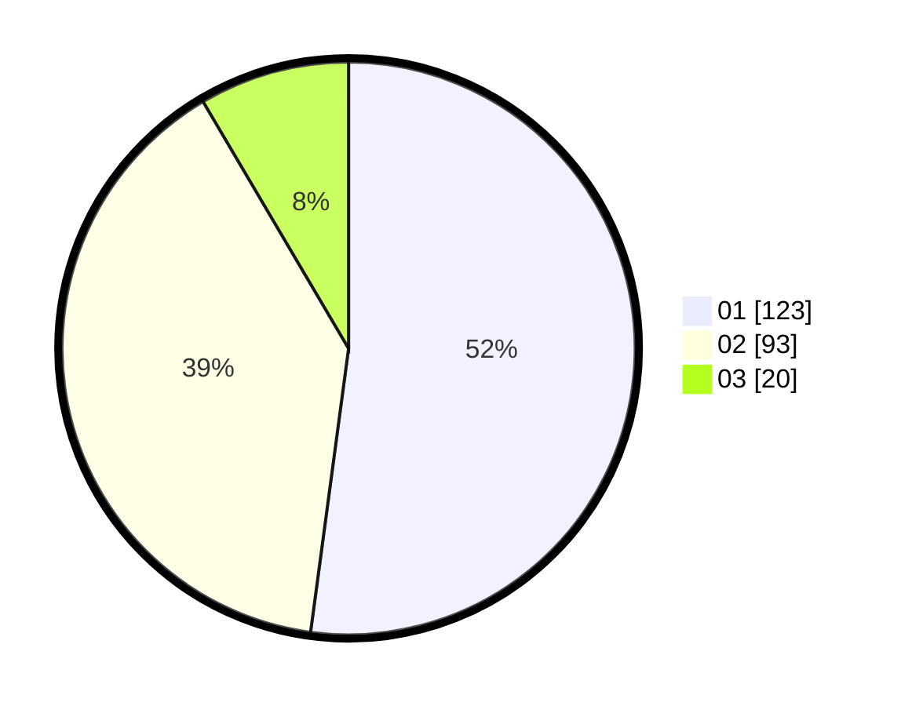

# Hasil

Hasil perolehan suara paslon dapat dilihat pada file paslon-01.txt, paslon-02.txt, dan paslon-03.txt.

Jika tidak ada, artinya data tersebut belum ada pada SIREKAP.

## Perolehan Suara

 * Paslon 01: **123**.
 * Paslon 02: **93**.
 * Paslon 03: **20**.

## Foto C Plano

https://sirekap-obj-formc.kpu.go.id/35a4/pemilu/ppwp/31/72/03/10/04/3172031004008-20240216-071517--2be38874-8f7c-4be6-ad0c-9f295270fb77.jpg

https://sirekap-obj-formc.kpu.go.id/35a4/pemilu/ppwp/31/72/03/10/04/3172031004008-20240216-071519--664d10c4-ce13-4783-825a-6a663609e6eb.jpg

https://sirekap-obj-formc.kpu.go.id/35a4/pemilu/ppwp/31/72/03/10/04/3172031004008-20240216-071518--f87bfa9b-b5b5-4e67-b0f8-12c225c17501.jpg

## DATA PEMILIH TETAP

Jumlah pemilih dalam DPT: **0**.
 * L: **0**.
 * P: **0**.

## DATA PENGGUNA HAK PILIH

Jumlah pengguna hak pilih dalam DPT: **0**.
 * L: **0**.
 * P: **0**.

Jumlah pengguna hak pilih dalam DPTb: **0**.
 * L: **0**.
 * P: **0**.

Jumlah pengguna hak pilih dalam DPK: **0**.
 * L: **0**.
 * P: **0**.

Jumlah pengguna hak pilih: **0**.
 * L: **0**.
 * P: **0**.

## JUMLAH SUARA SAH DAN TIDAK SAH

JUMLAH SELURUH SUARA SAH: **236**.

JUMLAH SUARA TIDAK SAH: **2**.

JUMLAH SELURUH SUARA SAH DAN SUARA TIDAK SAH: **238**.
