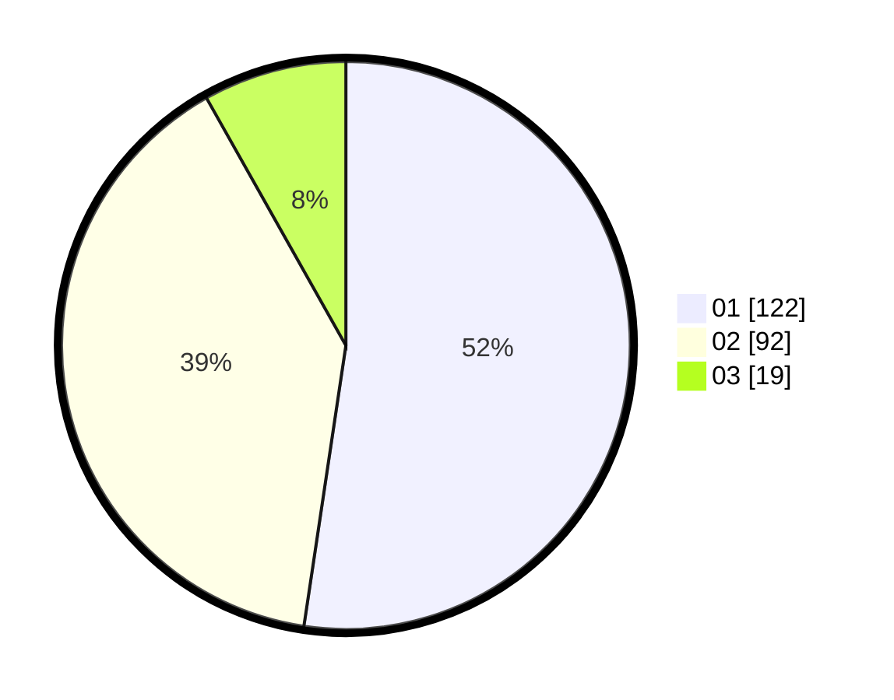

# Hasil

Hasil perolehan suara paslon dapat dilihat pada file paslon-01.txt, paslon-02.txt, dan paslon-03.txt.

Jika tidak ada, artinya data tersebut belum ada pada SIREKAP.

## Perolehan Suara

 * Paslon 01: **122**.
 * Paslon 02: **92**.
 * Paslon 03: **19**.

## Foto C Plano

https://sirekap-obj-formc.kpu.go.id/399f/pemilu/ppwp/31/72/03/10/04/3172031004010-20240214-234634--e89ebe34-bf39-4bec-b249-cf71678c7cff.jpg

https://sirekap-obj-formc.kpu.go.id/399f/pemilu/ppwp/31/72/03/10/04/3172031004010-20240214-234704--8d88af48-0f03-43a0-beae-b9bed497cd94.jpg

https://sirekap-obj-formc.kpu.go.id/399f/pemilu/ppwp/31/72/03/10/04/3172031004010-20240214-234733--b659e7e5-51e5-481d-b1bf-9a4874c84832.jpg

## DATA PEMILIH TETAP

Jumlah pemilih dalam DPT: **291**.
 * L: **142**.
 * P: **149**.

## DATA PENGGUNA HAK PILIH

Jumlah pengguna hak pilih dalam DPT: **223**.
 * L: **108**.
 * P: **115**.

Jumlah pengguna hak pilih dalam DPTb: **8**.
 * L: **6**.
 * P: **2**.

Jumlah pengguna hak pilih dalam DPK: **5**.
 * L: **2**.
 * P: **3**.

Jumlah pengguna hak pilih: **236**.
 * L: **116**.
 * P: **120**.

## JUMLAH SUARA SAH DAN TIDAK SAH

JUMLAH SELURUH SUARA SAH: **233**.

JUMLAH SUARA TIDAK SAH: **3**.

JUMLAH SELURUH SUARA SAH DAN SUARA TIDAK SAH: **236**.
