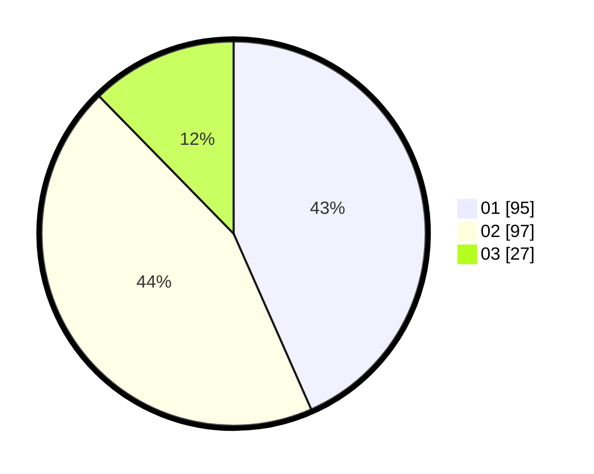

# Hasil

Hasil perolehan suara paslon dapat dilihat pada file paslon-01.txt, paslon-02.txt, dan paslon-03.txt.

Jika tidak ada, artinya data tersebut belum ada pada SIREKAP.

## Perolehan Suara

 * Paslon 01: **95**.
 * Paslon 02: **97**.
 * Paslon 03: **27**.

## Foto C Plano

https://sirekap-obj-formc.kpu.go.id/b0df/pemilu/ppwp/31/72/03/10/04/3172031004013-20240214-193926--9b0826a9-e059-4686-9e97-9152bad5534b.jpg

https://sirekap-obj-formc.kpu.go.id/b0df/pemilu/ppwp/31/72/03/10/04/3172031004013-20240214-193950--d08bab4a-6306-4e36-b901-8683b500812d.jpg

https://sirekap-obj-formc.kpu.go.id/b0df/pemilu/ppwp/31/72/03/10/04/3172031004013-20240214-194012--84ea8494-1847-46db-a2a9-0448ae91cf7e.jpg

## DATA PEMILIH TETAP

Jumlah pemilih dalam DPT: **289**.
 * L: **157**.
 * P: **132**.

## DATA PENGGUNA HAK PILIH

Jumlah pengguna hak pilih dalam DPT: **222**.
 * L: **115**.
 * P: **107**.

Jumlah pengguna hak pilih dalam DPTb: **0**.
 * L: **0**.
 * P: **0**.

Jumlah pengguna hak pilih dalam DPK: **1**.
 * L: **0**.
 * P: **1**.

Jumlah pengguna hak pilih: **223**.
 * L: **115**.
 * P: **108**.

## JUMLAH SUARA SAH DAN TIDAK SAH

JUMLAH SELURUH SUARA SAH: **219**.

JUMLAH SUARA TIDAK SAH: **4**.

JUMLAH SELURUH SUARA SAH DAN SUARA TIDAK SAH: **223**.
