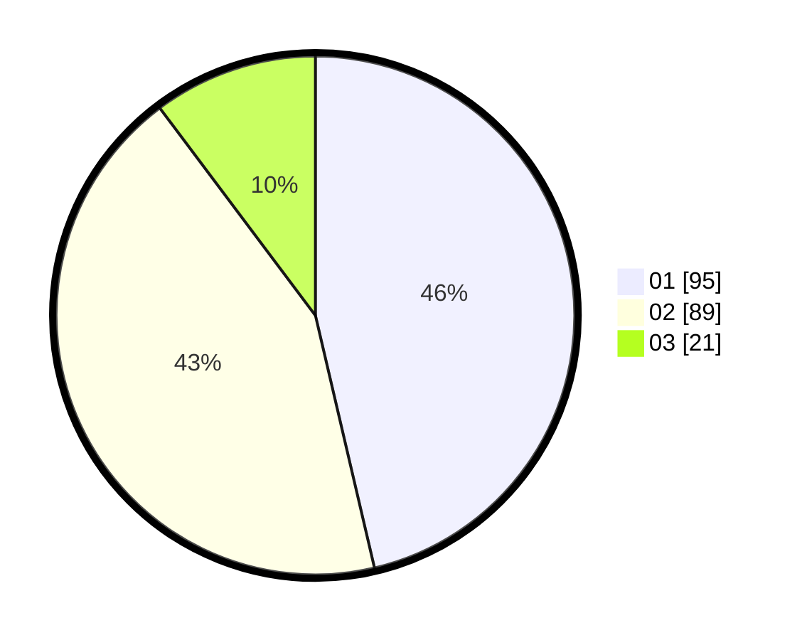

# Hasil

Hasil perolehan suara paslon dapat dilihat pada file paslon-01.txt, paslon-02.txt, dan paslon-03.txt.

Jika tidak ada, artinya data tersebut belum ada pada SIREKAP.

## Perolehan Suara

 * Paslon 01: **95**.
 * Paslon 02: **89**.
 * Paslon 03: **21**.

## Foto C Plano

https://sirekap-obj-formc.kpu.go.id/4906/pemilu/ppwp/31/72/03/10/04/3172031004015-20240216-174917--6f4b3be9-b9e8-45b5-a908-8b31df781bf4.jpg

https://sirekap-obj-formc.kpu.go.id/4906/pemilu/ppwp/31/72/03/10/04/3172031004015-20240216-174918--fb61ad04-ed6c-44bf-9ec7-41ea4cbf8c38.jpg

https://sirekap-obj-formc.kpu.go.id/4906/pemilu/ppwp/31/72/03/10/04/3172031004015-20240216-174917--5f756acf-204f-43e1-8fe4-e81379c2865c.jpg

## DATA PEMILIH TETAP

Jumlah pemilih dalam DPT: **265**.
 * L: **123**.
 * P: **142**.

## DATA PENGGUNA HAK PILIH

Jumlah pengguna hak pilih dalam DPT: **207**.
 * L: **93**.
 * P: **114**.

Jumlah pengguna hak pilih dalam DPTb: **0**.
 * L: **0**.
 * P: **0**.

Jumlah pengguna hak pilih dalam DPK: **0**.
 * L: **0**.
 * P: **0**.

Jumlah pengguna hak pilih: **207**.
 * L: **93**.
 * P: **114**.

## JUMLAH SUARA SAH DAN TIDAK SAH

JUMLAH SELURUH SUARA SAH: **205**.

JUMLAH SUARA TIDAK SAH: **2**.

JUMLAH SELURUH SUARA SAH DAN SUARA TIDAK SAH: **207**.
