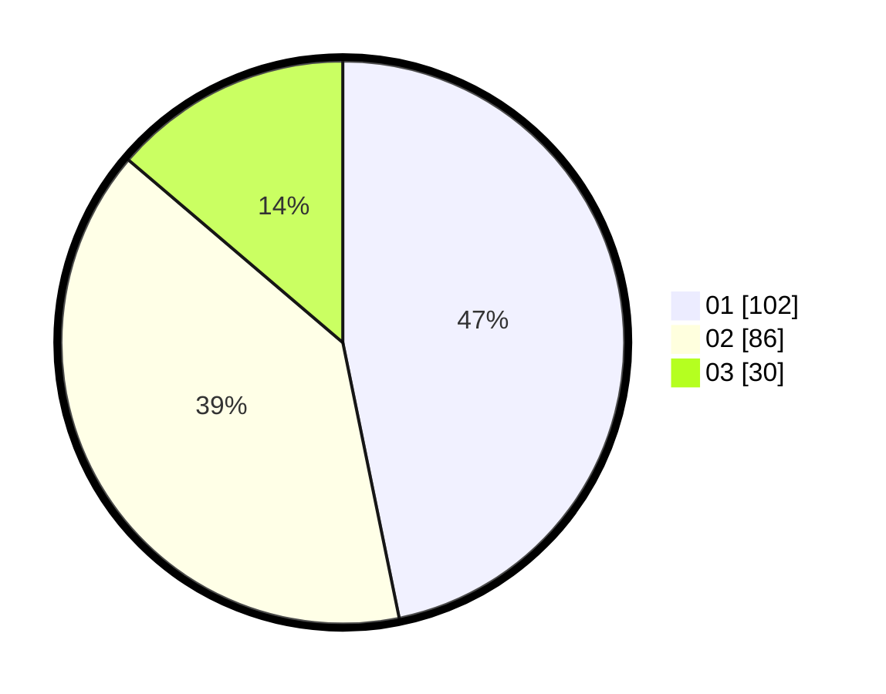

# Hasil

Hasil perolehan suara paslon dapat dilihat pada file paslon-01.txt, paslon-02.txt, dan paslon-03.txt.

Jika tidak ada, artinya data tersebut belum ada pada SIREKAP.

## Perolehan Suara

 * Paslon 01: **102**.
 * Paslon 02: **86**.
 * Paslon 03: **30**.

## Foto C Plano

https://sirekap-obj-formc.kpu.go.id/150a/pemilu/ppwp/31/72/03/10/04/3172031004016-20240214-155227--fa8ec589-cdf7-4052-82fa-b593e638376d.jpg

https://sirekap-obj-formc.kpu.go.id/150a/pemilu/ppwp/31/72/03/10/04/3172031004016-20240214-155557--715d50c4-9ad9-437c-ad6e-a40ab592e639.jpg

https://sirekap-obj-formc.kpu.go.id/150a/pemilu/ppwp/31/72/03/10/04/3172031004016-20240214-160125--ed315350-9ad6-41ee-bfcc-9e210c2d538d.jpg
