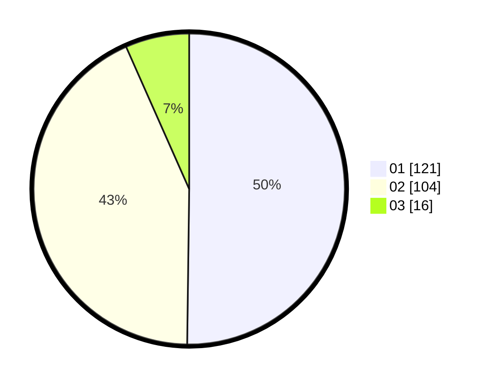

# Hasil

Hasil perolehan suara paslon dapat dilihat pada file paslon-01.txt, paslon-02.txt, dan paslon-03.txt.

Jika tidak ada, artinya data tersebut belum ada pada SIREKAP.

## Perolehan Suara

 * Paslon 01: **121**.
 * Paslon 02: **104**.
 * Paslon 03: **16**.

## Foto C Plano

https://sirekap-obj-formc.kpu.go.id/adba/pemilu/ppwp/31/72/03/10/04/3172031004018-20240216-100349--f2e4f349-9129-4d6e-ba97-ff3c232a27fb.jpg

https://sirekap-obj-formc.kpu.go.id/adba/pemilu/ppwp/31/72/03/10/04/3172031004018-20240216-100354--f6c41e64-e580-4f7c-8e48-43eecb31ccc1.jpg

https://sirekap-obj-formc.kpu.go.id/adba/pemilu/ppwp/31/72/03/10/04/3172031004018-20240216-100351--89aa5d57-20e2-4f7d-a415-eca366176127.jpg

## DATA PEMILIH TETAP

Jumlah pemilih dalam DPT: **277**.
 * L: **130**.
 * P: **147**.

## DATA PENGGUNA HAK PILIH

Jumlah pengguna hak pilih dalam DPT: **232**.
 * L: **99**.
 * P: **133**.

Jumlah pengguna hak pilih dalam DPTb: **4**.
 * L: **2**.
 * P: **2**.

Jumlah pengguna hak pilih dalam DPK: **7**.
 * L: **2**.
 * P: **5**.

Jumlah pengguna hak pilih: **243**.
 * L: **103**.
 * P: **140**.

## JUMLAH SUARA SAH DAN TIDAK SAH

JUMLAH SELURUH SUARA SAH: **241**.

JUMLAH SUARA TIDAK SAH: **2**.

JUMLAH SELURUH SUARA SAH DAN SUARA TIDAK SAH: **243**.
