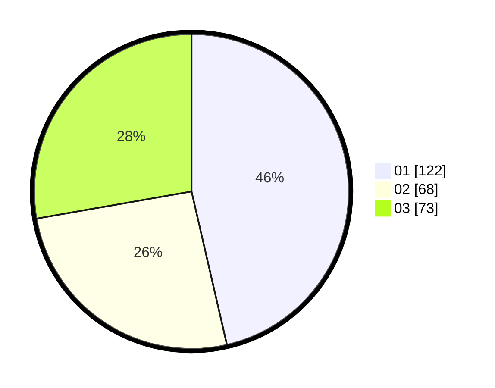

# Hasil

Hasil perolehan suara paslon dapat dilihat pada file paslon-01.txt, paslon-02.txt, dan paslon-03.txt.

Jika tidak ada, artinya data tersebut belum ada pada SIREKAP.

## Perolehan Suara

 * Paslon 01: **122**.
 * Paslon 02: **68**.
 * Paslon 03: **73**.

## Foto C Plano

https://sirekap-obj-formc.kpu.go.id/2a66/pemilu/ppwp/31/72/03/10/04/3172031004019-20240214-155048--53b69feb-4742-4884-8feb-cb4d625ed674.jpg

https://sirekap-obj-formc.kpu.go.id/2a66/pemilu/ppwp/31/72/03/10/04/3172031004019-20240214-155059--08e032bb-dc10-4b33-a35a-a09768eaee89.jpg
