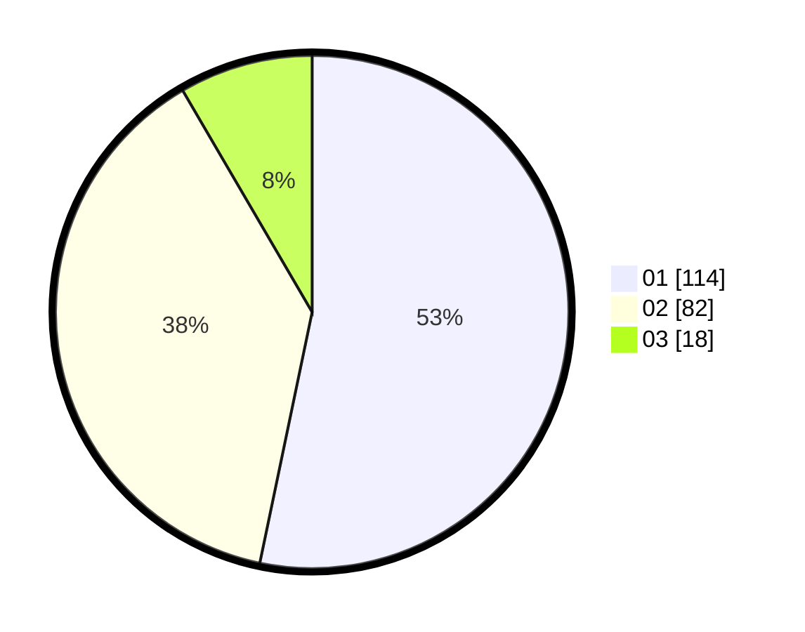

# Hasil

Hasil perolehan suara paslon dapat dilihat pada file paslon-01.txt, paslon-02.txt, dan paslon-03.txt.

Jika tidak ada, artinya data tersebut belum ada pada SIREKAP.

## Perolehan Suara

 * Paslon 01: **114**.
 * Paslon 02: **82**.
 * Paslon 03: **18**.

## Foto C Plano

https://sirekap-obj-formc.kpu.go.id/0600/pemilu/ppwp/31/72/03/10/04/3172031004021-20240216-004720--1294970c-9e5d-472a-9244-7f9da196f570.jpg

https://sirekap-obj-formc.kpu.go.id/0600/pemilu/ppwp/31/72/03/10/04/3172031004021-20240216-004731--30aab0b1-d451-4982-b9c6-6dd6b0bf3ee1.jpg

https://sirekap-obj-formc.kpu.go.id/0600/pemilu/ppwp/31/72/03/10/04/3172031004021-20240216-004726--0e7887d1-0db1-4da9-98ed-7c9d7df24900.jpg

## DATA PEMILIH TETAP

Jumlah pemilih dalam DPT: **289**.
 * L: **144**.
 * P: **145**.

## DATA PENGGUNA HAK PILIH

Jumlah pengguna hak pilih dalam DPT: **214**.
 * L: **102**.
 * P: **112**.

Jumlah pengguna hak pilih dalam DPTb: **2**.
 * L: **1**.
 * P: **1**.

Jumlah pengguna hak pilih dalam DPK: **0**.
 * L: **0**.
 * P: **0**.

Jumlah pengguna hak pilih: **216**.
 * L: **103**.
 * P: **113**.

## JUMLAH SUARA SAH DAN TIDAK SAH

JUMLAH SELURUH SUARA SAH: **214**.

JUMLAH SUARA TIDAK SAH: **2**.

JUMLAH SELURUH SUARA SAH DAN SUARA TIDAK SAH: **216**.
