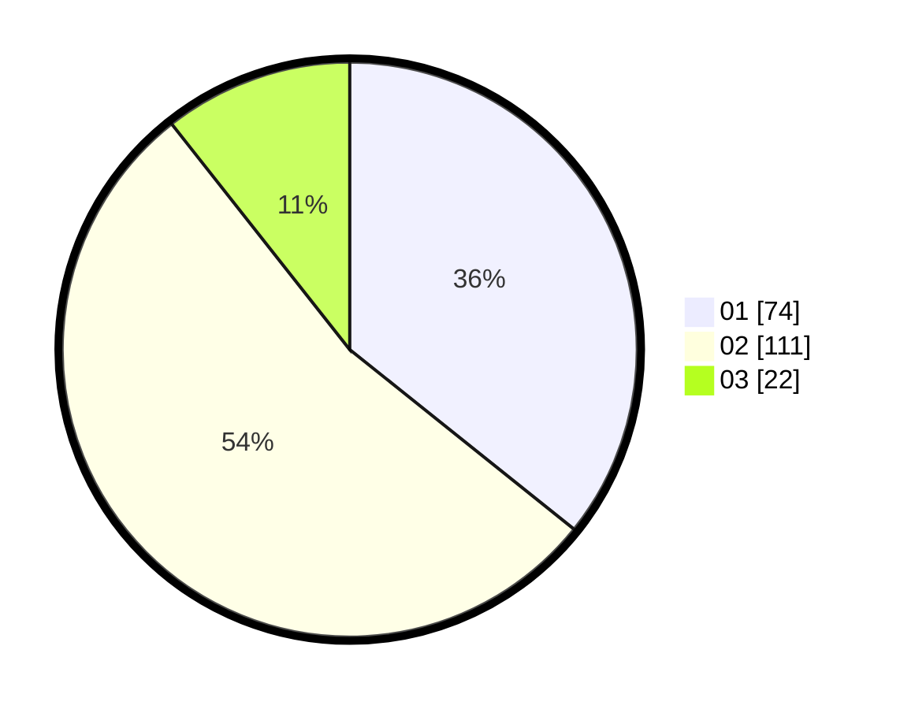

# Hasil

Hasil perolehan suara paslon dapat dilihat pada file paslon-01.txt, paslon-02.txt, dan paslon-03.txt.

Jika tidak ada, artinya data tersebut belum ada pada SIREKAP.

## Perolehan Suara

 * Paslon 01: **74**.
 * Paslon 02: **111**.
 * Paslon 03: **22**.

## Foto C Plano

https://sirekap-obj-formc.kpu.go.id/c5ca/pemilu/ppwp/31/72/03/10/04/3172031004023-20240215-002124--6513cf99-fa68-4b93-83c5-d1e217b6fbd6.jpg

https://sirekap-obj-formc.kpu.go.id/c5ca/pemilu/ppwp/31/72/03/10/04/3172031004023-20240214-160141--dd3d0744-51ff-4436-8a9c-705448843207.jpg

https://sirekap-obj-formc.kpu.go.id/c5ca/pemilu/ppwp/31/72/03/10/04/3172031004023-20240215-002341--2bfdcadc-211f-44a7-bcb0-b782ca1f3deb.jpg
