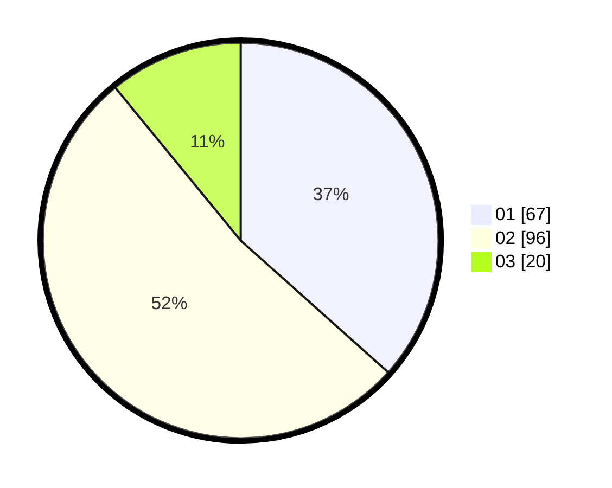

# Hasil

Hasil perolehan suara paslon dapat dilihat pada file paslon-01.txt, paslon-02.txt, dan paslon-03.txt.

Jika tidak ada, artinya data tersebut belum ada pada SIREKAP.

## Perolehan Suara

 * Paslon 01: **67**.
 * Paslon 02: **96**.
 * Paslon 03: **20**.

## Foto C Plano

https://sirekap-obj-formc.kpu.go.id/80e7/pemilu/ppwp/31/72/03/10/04/3172031004026-20240216-173418--ec0447a1-fa26-45e7-826e-ff4b506908c8.jpg

https://sirekap-obj-formc.kpu.go.id/80e7/pemilu/ppwp/31/72/03/10/04/3172031004026-20240216-173419--0f164b01-8812-4855-8961-2b8d97cfa419.jpg

https://sirekap-obj-formc.kpu.go.id/80e7/pemilu/ppwp/31/72/03/10/04/3172031004026-20240216-173418--ad1c9879-7155-406c-ac9d-7b8ede4d8585.jpg

## DATA PEMILIH TETAP

Jumlah pemilih dalam DPT: **247**.
 * L: **119**.
 * P: **128**.

## DATA PENGGUNA HAK PILIH

Jumlah pengguna hak pilih dalam DPT: **184**.
 * L: **89**.
 * P: **95**.

Jumlah pengguna hak pilih dalam DPTb: **1**.
 * L: **0**.
 * P: **1**.

Jumlah pengguna hak pilih dalam DPK: **2**.
 * L: **2**.
 * P: **0**.

Jumlah pengguna hak pilih: **187**.
 * L: **91**.
 * P: **96**.

## JUMLAH SUARA SAH DAN TIDAK SAH

JUMLAH SELURUH SUARA SAH: **183**.

JUMLAH SUARA TIDAK SAH: **4**.

JUMLAH SELURUH SUARA SAH DAN SUARA TIDAK SAH: **187**.
