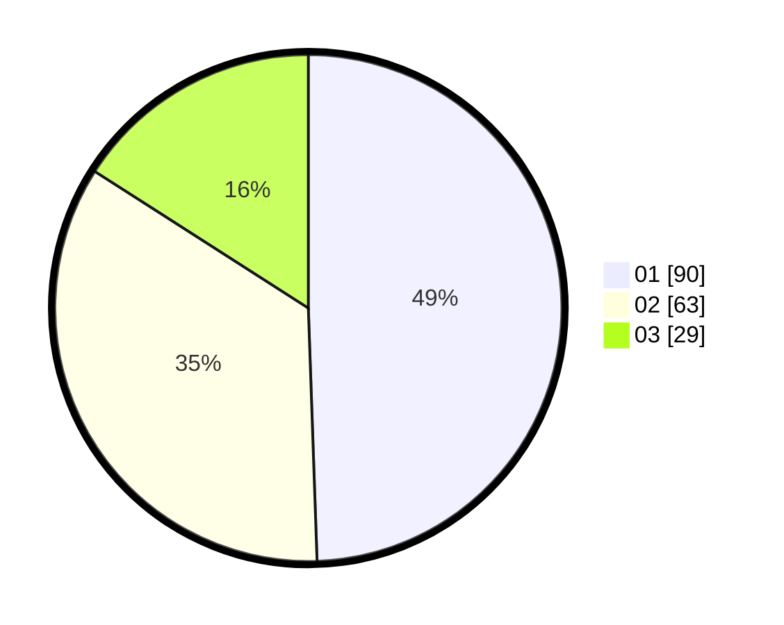

# Hasil

Hasil perolehan suara paslon dapat dilihat pada file paslon-01.txt, paslon-02.txt, dan paslon-03.txt.

Jika tidak ada, artinya data tersebut belum ada pada SIREKAP.

## Perolehan Suara

 * Paslon 01: **90**.
 * Paslon 02: **63**.
 * Paslon 03: **29**.

## Foto C Plano

https://sirekap-obj-formc.kpu.go.id/b7c7/pemilu/ppwp/31/72/03/10/04/3172031004029-20240216-063648--320ace2f-2f90-4b98-9940-ed1bce564eaa.jpg

https://sirekap-obj-formc.kpu.go.id/b7c7/pemilu/ppwp/31/72/03/10/04/3172031004029-20240216-063658--43818ca0-58dd-476b-b854-5c02e6663f3e.jpg

https://sirekap-obj-formc.kpu.go.id/b7c7/pemilu/ppwp/31/72/03/10/04/3172031004029-20240216-063655--284d5626-0df0-4314-8112-012c73eb07b4.jpg

## DATA PEMILIH TETAP

Jumlah pemilih dalam DPT: **259**.
 * L: **121**.
 * P: **138**.

## DATA PENGGUNA HAK PILIH

Jumlah pengguna hak pilih dalam DPT: **182**.
 * L: **83**.
 * P: **99**.

Jumlah pengguna hak pilih dalam DPTb: **1**.
 * L: **0**.
 * P: **1**.

Jumlah pengguna hak pilih dalam DPK: **0**.
 * L: **0**.
 * P: **0**.

Jumlah pengguna hak pilih: **183**.
 * L: **83**.
 * P: **100**.

## JUMLAH SUARA SAH DAN TIDAK SAH

JUMLAH SELURUH SUARA SAH: **182**.

JUMLAH SUARA TIDAK SAH: **1**.

JUMLAH SELURUH SUARA SAH DAN SUARA TIDAK SAH: **183**.
