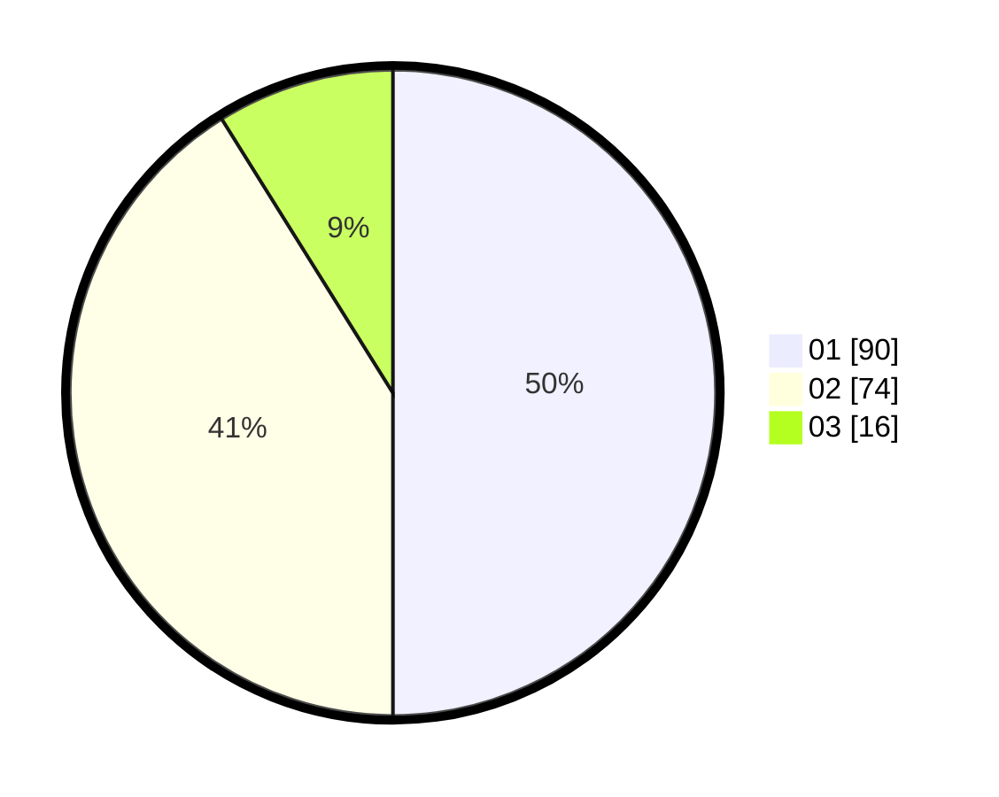

# Hasil

Hasil perolehan suara paslon dapat dilihat pada file paslon-01.txt, paslon-02.txt, dan paslon-03.txt.

Jika tidak ada, artinya data tersebut belum ada pada SIREKAP.

## Perolehan Suara

 * Paslon 01: **90**.
 * Paslon 02: **74**.
 * Paslon 03: **16**.

## Foto C Plano

https://sirekap-obj-formc.kpu.go.id/3838/pemilu/ppwp/31/72/03/10/04/3172031004033-20240214-155913--2d3559b1-c9bb-48cc-909f-21e2b13dcabd.jpg

https://sirekap-obj-formc.kpu.go.id/3838/pemilu/ppwp/31/72/03/10/04/3172031004033-20240214-155612--86962a8c-91e9-423f-b870-de9bde67da28.jpg

https://sirekap-obj-formc.kpu.go.id/3838/pemilu/ppwp/31/72/03/10/04/3172031004033-20240214-155748--e4f22807-90c8-4cdd-a8d9-a2096fc2395d.jpg

## DATA PEMILIH TETAP

Jumlah pemilih dalam DPT: **266**.
 * L: **128**.
 * P: **138**.

## DATA PENGGUNA HAK PILIH

Jumlah pengguna hak pilih dalam DPT: **183**.
 * L: **82**.
 * P: **101**.

Jumlah pengguna hak pilih dalam DPTb: **0**.
 * L: **0**.
 * P: **0**.

Jumlah pengguna hak pilih dalam DPK: **1**.
 * L: **0**.
 * P: **1**.

Jumlah pengguna hak pilih: **184**.
 * L: **82**.
 * P: **102**.

## JUMLAH SUARA SAH DAN TIDAK SAH

JUMLAH SELURUH SUARA SAH: **180**.

JUMLAH SUARA TIDAK SAH: **4**.

JUMLAH SELURUH SUARA SAH DAN SUARA TIDAK SAH: **184**.
