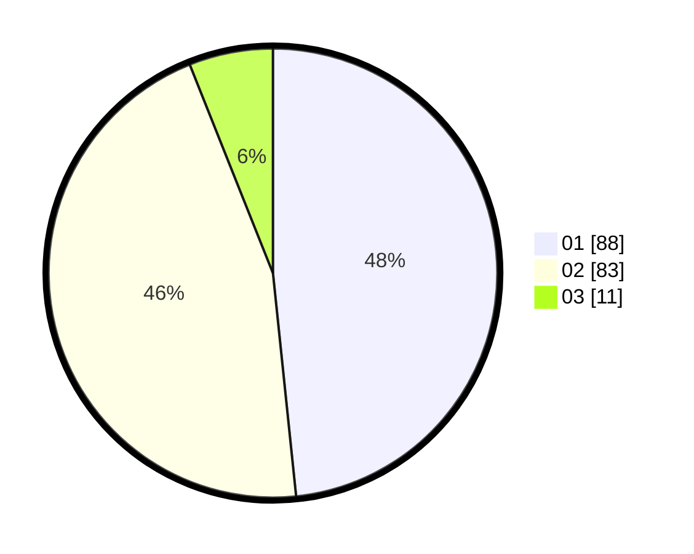

# Hasil

Hasil perolehan suara paslon dapat dilihat pada file paslon-01.txt, paslon-02.txt, dan paslon-03.txt.

Jika tidak ada, artinya data tersebut belum ada pada SIREKAP.

## Perolehan Suara

 * Paslon 01: **88**.
 * Paslon 02: **83**.
 * Paslon 03: **11**.

## Foto C Plano

https://sirekap-obj-formc.kpu.go.id/fc1d/pemilu/ppwp/31/72/03/10/04/3172031004034-20240215-195253--8f93ba35-5833-4593-9f99-11f6cc7a32d3.jpg

https://sirekap-obj-formc.kpu.go.id/fc1d/pemilu/ppwp/31/72/03/10/04/3172031004034-20240215-195314--bf2ecec0-4db3-4fa7-8524-08852d03c343.jpg

https://sirekap-obj-formc.kpu.go.id/fc1d/pemilu/ppwp/31/72/03/10/04/3172031004034-20240215-195304--8e866ccf-c84b-492e-8611-2e9e5879e31e.jpg

## DATA PEMILIH TETAP

Jumlah pemilih dalam DPT: **269**.
 * L: **127**.
 * P: **142**.

## DATA PENGGUNA HAK PILIH

Jumlah pengguna hak pilih dalam DPT: **180**.
 * L: **81**.
 * P: **99**.

Jumlah pengguna hak pilih dalam DPTb: **0**.
 * L: **0**.
 * P: **0**.

Jumlah pengguna hak pilih dalam DPK: **8**.
 * L: **4**.
 * P: **4**.

Jumlah pengguna hak pilih: **188**.
 * L: **85**.
 * P: **103**.

## JUMLAH SUARA SAH DAN TIDAK SAH

JUMLAH SELURUH SUARA SAH: **182**.

JUMLAH SUARA TIDAK SAH: **6**.

JUMLAH SELURUH SUARA SAH DAN SUARA TIDAK SAH: **188**.
