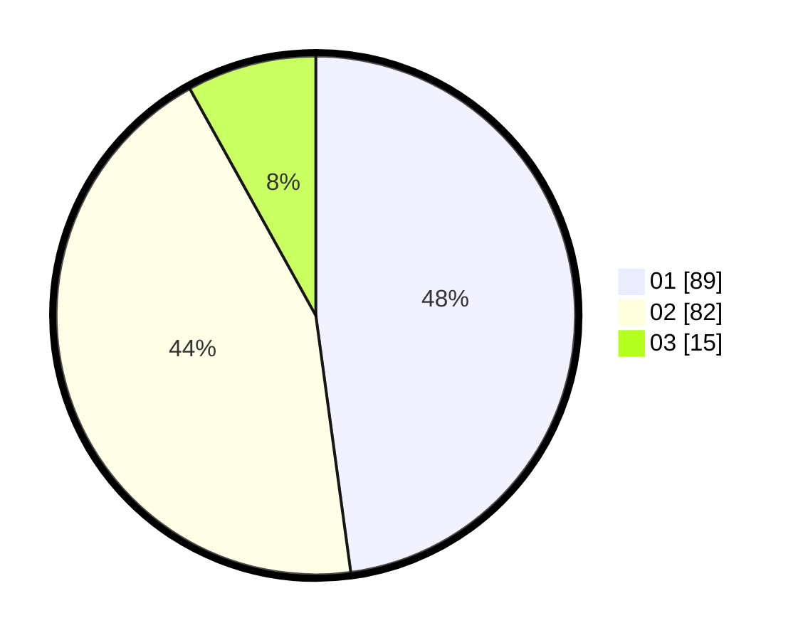

# Hasil

Hasil perolehan suara paslon dapat dilihat pada file paslon-01.txt, paslon-02.txt, dan paslon-03.txt.

Jika tidak ada, artinya data tersebut belum ada pada SIREKAP.

## Perolehan Suara

 * Paslon 01: **89**.
 * Paslon 02: **82**.
 * Paslon 03: **15**.

## Foto C Plano

https://sirekap-obj-formc.kpu.go.id/c449/pemilu/ppwp/31/72/03/10/04/3172031004035-20240216-175918--8eb2f5af-8664-46fd-943a-2ba28cd62de4.jpg

https://sirekap-obj-formc.kpu.go.id/c449/pemilu/ppwp/31/72/03/10/04/3172031004035-20240216-175920--06f1191f-75ec-46c2-a093-63ff3e2d705e.jpg

https://sirekap-obj-formc.kpu.go.id/c449/pemilu/ppwp/31/72/03/10/04/3172031004035-20240216-175919--fd8aa636-a660-471b-8e9f-94d794865717.jpg

## DATA PEMILIH TETAP

Jumlah pemilih dalam DPT: **266**.
 * L: **130**.
 * P: **136**.

## DATA PENGGUNA HAK PILIH

Jumlah pengguna hak pilih dalam DPT: **188**.
 * L: **91**.
 * P: **97**.

Jumlah pengguna hak pilih dalam DPTb: **2**.
 * L: **1**.
 * P: **1**.

Jumlah pengguna hak pilih dalam DPK: **0**.
 * L: **0**.
 * P: **0**.

Jumlah pengguna hak pilih: **190**.
 * L: **92**.
 * P: **98**.

## JUMLAH SUARA SAH DAN TIDAK SAH

JUMLAH SELURUH SUARA SAH: **186**.

JUMLAH SUARA TIDAK SAH: **4**.

JUMLAH SELURUH SUARA SAH DAN SUARA TIDAK SAH: **190**.
