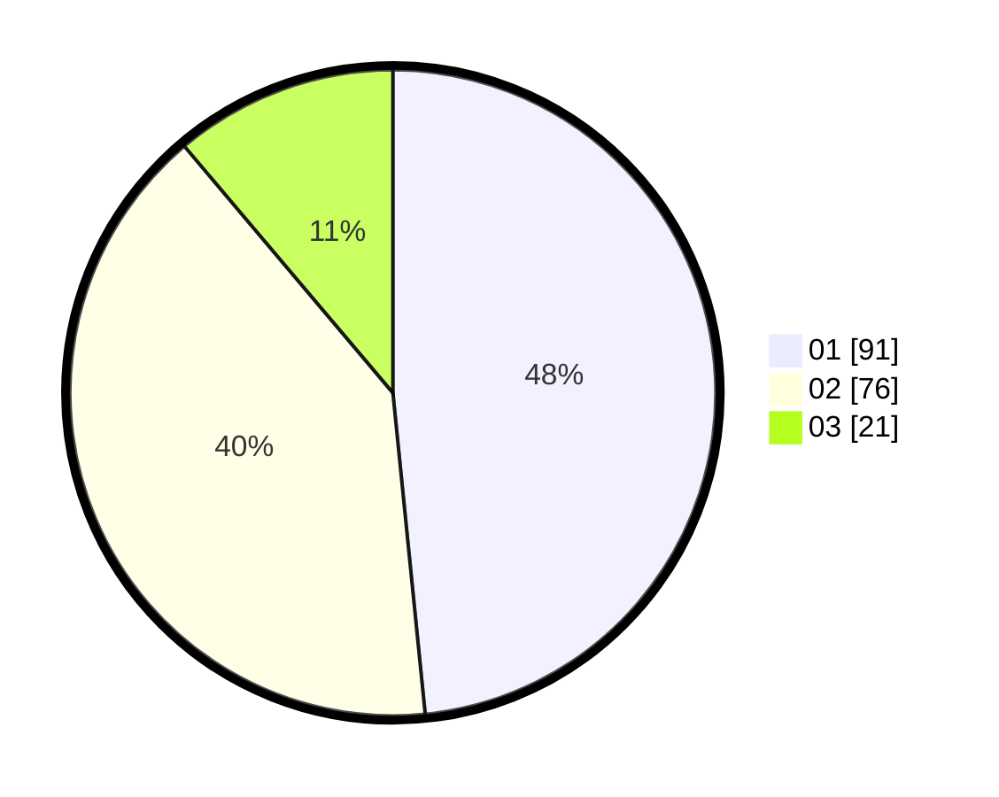

# Hasil

Hasil perolehan suara paslon dapat dilihat pada file paslon-01.txt, paslon-02.txt, dan paslon-03.txt.

Jika tidak ada, artinya data tersebut belum ada pada SIREKAP.

## Perolehan Suara

 * Paslon 01: **91**.
 * Paslon 02: **76**.
 * Paslon 03: **21**.

## Foto C Plano

https://sirekap-obj-formc.kpu.go.id/afd2/pemilu/ppwp/31/72/03/10/04/3172031004036-20240214-202255--b36e0832-ffaf-47f7-89f0-1dacbbae6bb5.jpg

https://sirekap-obj-formc.kpu.go.id/afd2/pemilu/ppwp/31/72/03/10/04/3172031004036-20240214-201243--ea47fc45-9858-4e13-9a2d-42b661f5c1b3.jpg

https://sirekap-obj-formc.kpu.go.id/afd2/pemilu/ppwp/31/72/03/10/04/3172031004036-20240214-202609--9c700d0e-613b-46ed-aca2-02f258cc795e.jpg

## DATA PEMILIH TETAP

Jumlah pemilih dalam DPT: **254**.
 * L: **124**.
 * P: **130**.

## DATA PENGGUNA HAK PILIH

Jumlah pengguna hak pilih dalam DPT: **191**.
 * L: **93**.
 * P: **98**.

Jumlah pengguna hak pilih dalam DPTb: **0**.
 * L: **0**.
 * P: **0**.

Jumlah pengguna hak pilih dalam DPK: **3**.
 * L: **2**.
 * P: **1**.

Jumlah pengguna hak pilih: **194**.
 * L: **95**.
 * P: **99**.

## JUMLAH SUARA SAH DAN TIDAK SAH

JUMLAH SELURUH SUARA SAH: **188**.

JUMLAH SUARA TIDAK SAH: **6**.

JUMLAH SELURUH SUARA SAH DAN SUARA TIDAK SAH: **194**.
