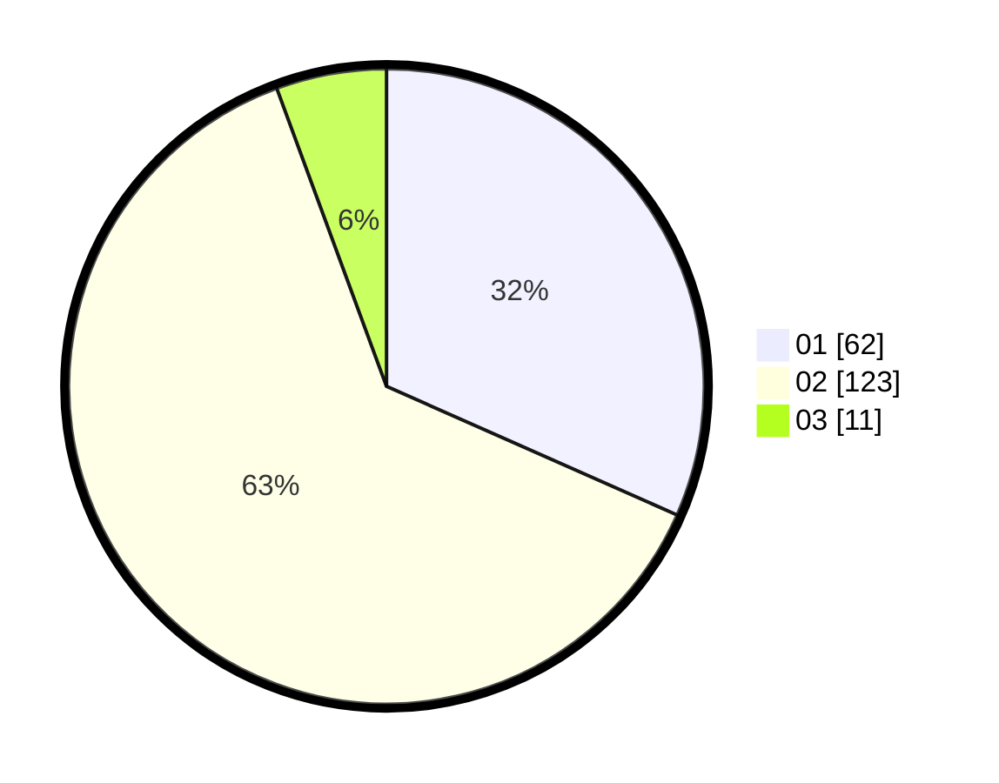

# Hasil

Hasil perolehan suara paslon dapat dilihat pada file paslon-01.txt, paslon-02.txt, dan paslon-03.txt.

Jika tidak ada, artinya data tersebut belum ada pada SIREKAP.

## Perolehan Suara

 * Paslon 01: **62**.
 * Paslon 02: **123**.
 * Paslon 03: **11**.

## Foto C Plano

https://sirekap-obj-formc.kpu.go.id/fc31/pemilu/ppwp/31/72/03/10/04/3172031004038-20240216-044949--07c345cc-02be-4691-aad2-c1ccb257a873.jpg

https://sirekap-obj-formc.kpu.go.id/fc31/pemilu/ppwp/31/72/03/10/04/3172031004038-20240216-045001--e2476891-63e0-48d2-8559-ce69b021c735.jpg

https://sirekap-obj-formc.kpu.go.id/fc31/pemilu/ppwp/31/72/03/10/04/3172031004038-20240216-044954--d5bd58e3-9aff-457f-9e6a-2a2b87730d8e.jpg

## DATA PEMILIH TETAP

Jumlah pemilih dalam DPT: **273**.
 * L: **141**.
 * P: **132**.

## DATA PENGGUNA HAK PILIH

Jumlah pengguna hak pilih dalam DPT: **201**.
 * L: **96**.
 * P: **105**.

Jumlah pengguna hak pilih dalam DPTb: **0**.
 * L: **0**.
 * P: **0**.

Jumlah pengguna hak pilih dalam DPK: **1**.
 * L: **1**.
 * P: **0**.

Jumlah pengguna hak pilih: **202**.
 * L: **97**.
 * P: **105**.

## JUMLAH SUARA SAH DAN TIDAK SAH

JUMLAH SELURUH SUARA SAH: **196**.

JUMLAH SUARA TIDAK SAH: **6**.

JUMLAH SELURUH SUARA SAH DAN SUARA TIDAK SAH: **202**.
