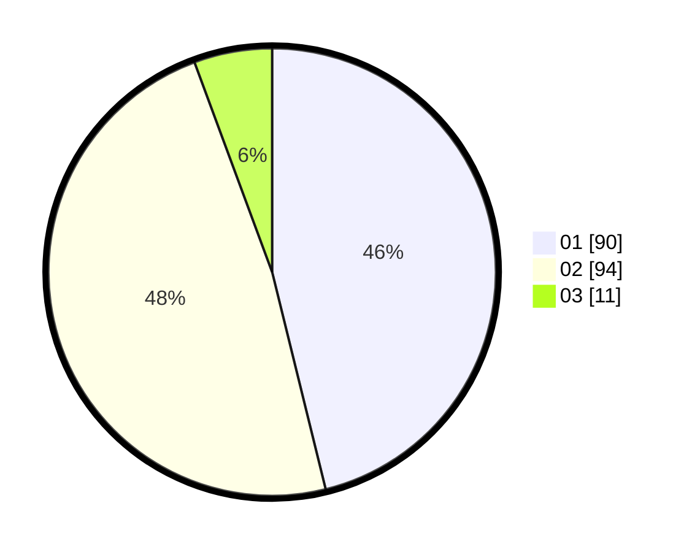

# Hasil

Hasil perolehan suara paslon dapat dilihat pada file paslon-01.txt, paslon-02.txt, dan paslon-03.txt.

Jika tidak ada, artinya data tersebut belum ada pada SIREKAP.

## Perolehan Suara

 * Paslon 01: **90**.
 * Paslon 02: **94**.
 * Paslon 03: **11**.

## Foto C Plano

https://sirekap-obj-formc.kpu.go.id/6860/pemilu/ppwp/31/72/03/10/04/3172031004040-20240216-183557--d7752063-edda-4eee-ad09-dabbe7a3a9b2.jpg

https://sirekap-obj-formc.kpu.go.id/6860/pemilu/ppwp/31/72/03/10/04/3172031004040-20240216-183558--da5acec9-ff7c-4a87-aa05-95be1540bc95.jpg

https://sirekap-obj-formc.kpu.go.id/6860/pemilu/ppwp/31/72/03/10/04/3172031004040-20240216-183557--14adfccd-01fa-4bcc-97f6-020bf8fdc30f.jpg

## DATA PEMILIH TETAP

Jumlah pemilih dalam DPT: **277**.
 * L: **138**.
 * P: **139**.

## DATA PENGGUNA HAK PILIH

Jumlah pengguna hak pilih dalam DPT: **199**.
 * L: **93**.
 * P: **106**.

Jumlah pengguna hak pilih dalam DPTb: **0**.
 * L: **0**.
 * P: **0**.

Jumlah pengguna hak pilih dalam DPK: **0**.
 * L: **0**.
 * P: **0**.

Jumlah pengguna hak pilih: **199**.
 * L: **93**.
 * P: **106**.

## JUMLAH SUARA SAH DAN TIDAK SAH

JUMLAH SELURUH SUARA SAH: **195**.

JUMLAH SUARA TIDAK SAH: **4**.

JUMLAH SELURUH SUARA SAH DAN SUARA TIDAK SAH: **199**.
