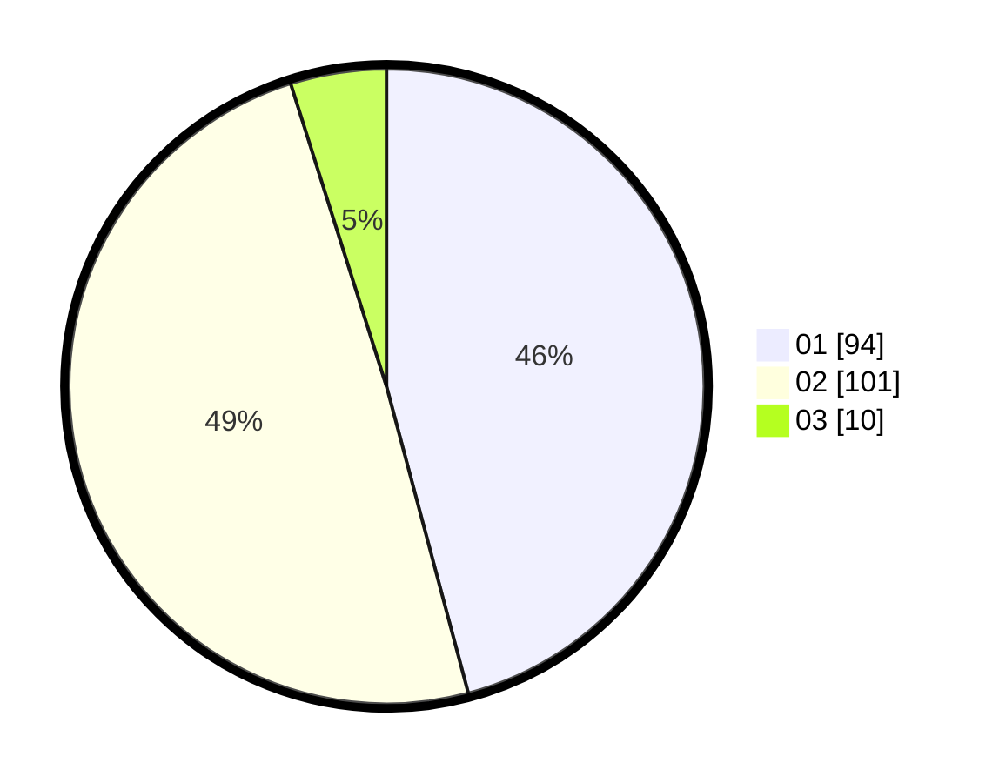

# Hasil

Hasil perolehan suara paslon dapat dilihat pada file paslon-01.txt, paslon-02.txt, dan paslon-03.txt.

Jika tidak ada, artinya data tersebut belum ada pada SIREKAP.

## Perolehan Suara

 * Paslon 01: **94**.
 * Paslon 02: **101**.
 * Paslon 03: **10**.

## Foto C Plano

https://sirekap-obj-formc.kpu.go.id/8a04/pemilu/ppwp/31/72/03/10/04/3172031004042-20240215-195239--1cac0fbd-af94-4ee9-8e84-5ef1c9991757.jpg

https://sirekap-obj-formc.kpu.go.id/8a04/pemilu/ppwp/31/72/03/10/04/3172031004042-20240215-195301--c82fc87b-4514-4371-b4d7-949c2a15cd33.jpg

https://sirekap-obj-formc.kpu.go.id/8a04/pemilu/ppwp/31/72/03/10/04/3172031004042-20240215-195250--b91f73aa-3efa-4239-9602-6509baf83b70.jpg

## DATA PEMILIH TETAP

Jumlah pemilih dalam DPT: **278**.
 * L: **144**.
 * P: **134**.

## DATA PENGGUNA HAK PILIH

Jumlah pengguna hak pilih dalam DPT: **202**.
 * L: **100**.
 * P: **102**.

Jumlah pengguna hak pilih dalam DPTb: **1**.
 * L: **1**.
 * P: **0**.

Jumlah pengguna hak pilih dalam DPK: **4**.
 * L: **3**.
 * P: **1**.

Jumlah pengguna hak pilih: **207**.
 * L: **104**.
 * P: **103**.

## JUMLAH SUARA SAH DAN TIDAK SAH

JUMLAH SELURUH SUARA SAH: **205**.

JUMLAH SUARA TIDAK SAH: **2**.

JUMLAH SELURUH SUARA SAH DAN SUARA TIDAK SAH: **207**.
