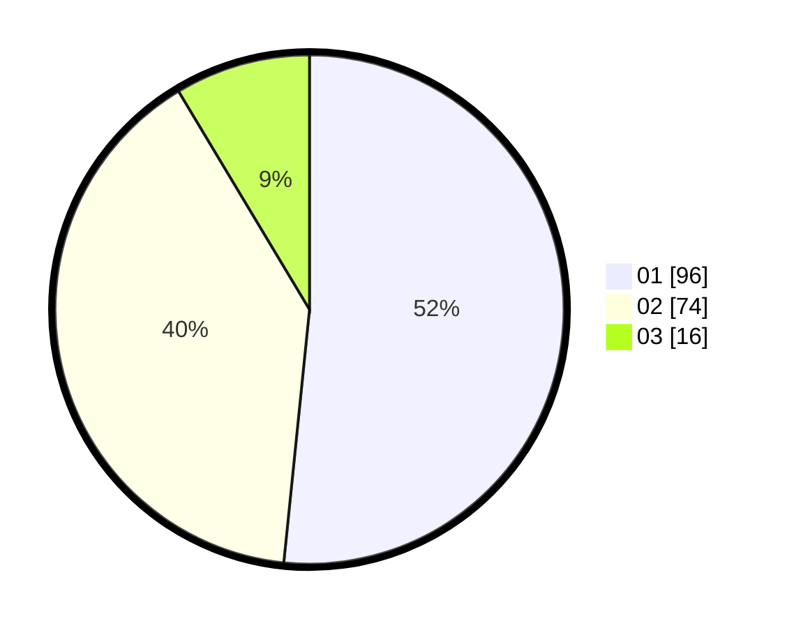

# Hasil

Hasil perolehan suara paslon dapat dilihat pada file paslon-01.txt, paslon-02.txt, dan paslon-03.txt.

Jika tidak ada, artinya data tersebut belum ada pada SIREKAP.

## Perolehan Suara

 * Paslon 01: **96**.
 * Paslon 02: **74**.
 * Paslon 03: **16**.

## Foto C Plano

https://sirekap-obj-formc.kpu.go.id/347d/pemilu/ppwp/31/72/03/10/04/3172031004048-20240215-204001--a3d11ed1-799b-401e-9e2b-f99ecb1016b6.jpg

https://sirekap-obj-formc.kpu.go.id/347d/pemilu/ppwp/31/72/03/10/04/3172031004048-20240214-185242--056f649e-82e5-49a5-847a-7edddd8a170e.jpg

https://sirekap-obj-formc.kpu.go.id/347d/pemilu/ppwp/31/72/03/10/04/3172031004048-20240214-185528--25580f0e-6428-472a-a694-b499ffe5ce6d.jpg

## DATA PEMILIH TETAP

Jumlah pemilih dalam DPT: **275**.
 * L: **133**.
 * P: **142**.

## DATA PENGGUNA HAK PILIH

Jumlah pengguna hak pilih dalam DPT: **181**.
 * L: **84**.
 * P: **97**.

Jumlah pengguna hak pilih dalam DPTb: **1**.
 * L: **0**.
 * P: **1**.

Jumlah pengguna hak pilih dalam DPK: **8**.
 * L: **4**.
 * P: **4**.

Jumlah pengguna hak pilih: **190**.
 * L: **88**.
 * P: **102**.

## JUMLAH SUARA SAH DAN TIDAK SAH

JUMLAH SELURUH SUARA SAH: **186**.

JUMLAH SUARA TIDAK SAH: **4**.

JUMLAH SELURUH SUARA SAH DAN SUARA TIDAK SAH: **190**.
