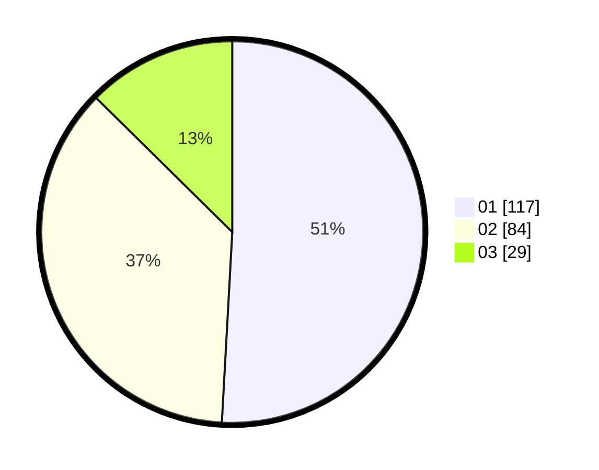

# Hasil

Hasil perolehan suara paslon dapat dilihat pada file paslon-01.txt, paslon-02.txt, dan paslon-03.txt.

Jika tidak ada, artinya data tersebut belum ada pada SIREKAP.

## Perolehan Suara

 * Paslon 01: **117**.
 * Paslon 02: **84**.
 * Paslon 03: **29**.

## Foto C Plano

https://sirekap-obj-formc.kpu.go.id/c27e/pemilu/ppwp/31/72/03/10/04/3172031004050-20240214-195229--6f0e9ae9-0926-4075-8f30-6a7a2094c8f3.jpg

https://sirekap-obj-formc.kpu.go.id/c27e/pemilu/ppwp/31/72/03/10/04/3172031004050-20240214-195444--21e1c5ac-aef4-4684-b58d-c7d1388c3349.jpg

https://sirekap-obj-formc.kpu.go.id/c27e/pemilu/ppwp/31/72/03/10/04/3172031004050-20240214-193839--2a857ffc-3b02-4616-b293-985d09156a67.jpg

## DATA PEMILIH TETAP

Jumlah pemilih dalam DPT: **283**.
 * L: **137**.
 * P: **146**.

## DATA PENGGUNA HAK PILIH

Jumlah pengguna hak pilih dalam DPT: **230**.
 * L: **108**.
 * P: **122**.

Jumlah pengguna hak pilih dalam DPTb: **0**.
 * L: **0**.
 * P: **0**.

Jumlah pengguna hak pilih dalam DPK: **4**.
 * L: **1**.
 * P: **3**.

Jumlah pengguna hak pilih: **234**.
 * L: **109**.
 * P: **125**.

## JUMLAH SUARA SAH DAN TIDAK SAH

JUMLAH SELURUH SUARA SAH: **230**.

JUMLAH SUARA TIDAK SAH: **4**.

JUMLAH SELURUH SUARA SAH DAN SUARA TIDAK SAH: **234**.
