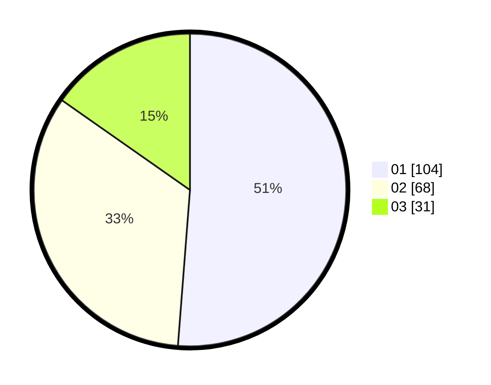

# Hasil

Hasil perolehan suara paslon dapat dilihat pada file paslon-01.txt, paslon-02.txt, dan paslon-03.txt.

Jika tidak ada, artinya data tersebut belum ada pada SIREKAP.

## Perolehan Suara

 * Paslon 01: **104**.
 * Paslon 02: **68**.
 * Paslon 03: **31**.

## Foto C Plano

https://sirekap-obj-formc.kpu.go.id/5336/pemilu/ppwp/31/72/03/10/04/3172031004051-20240214-221552--a46ab069-3d67-469f-baea-57ab5cf5650d.jpg

https://sirekap-obj-formc.kpu.go.id/5336/pemilu/ppwp/31/72/03/10/04/3172031004051-20240214-221826--110d499f-b4e5-4696-9e41-daedec4630f4.jpg

https://sirekap-obj-formc.kpu.go.id/5336/pemilu/ppwp/31/72/03/10/04/3172031004051-20240214-221911--67f1852d-0e02-443b-839d-a16984a561ab.jpg
