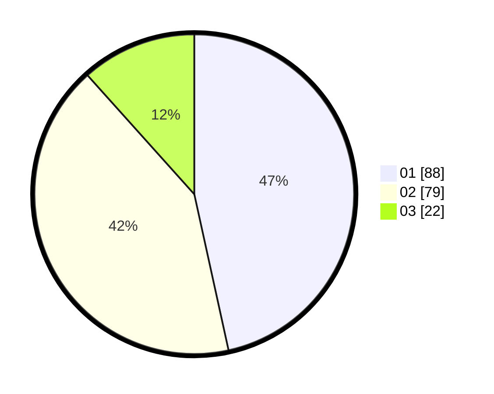

# Hasil

Hasil perolehan suara paslon dapat dilihat pada file paslon-01.txt, paslon-02.txt, dan paslon-03.txt.

Jika tidak ada, artinya data tersebut belum ada pada SIREKAP.

## Perolehan Suara

 * Paslon 01: **88**.
 * Paslon 02: **79**.
 * Paslon 03: **22**.

## Foto C Plano

https://sirekap-obj-formc.kpu.go.id/c8fb/pemilu/ppwp/31/72/03/10/04/3172031004058-20240216-140205--ee029fc5-d168-4d37-9f00-5b064cb22d10.jpg

https://sirekap-obj-formc.kpu.go.id/c8fb/pemilu/ppwp/31/72/03/10/04/3172031004058-20240216-140206--a28935e0-6bc5-4e75-8aac-4fab203a587a.jpg

https://sirekap-obj-formc.kpu.go.id/c8fb/pemilu/ppwp/31/72/03/10/04/3172031004058-20240216-140205--ef319e16-60c6-4059-844f-46481cde87b8.jpg

## DATA PEMILIH TETAP

Jumlah pemilih dalam DPT: **265**.
 * L: **134**.
 * P: **131**.

## DATA PENGGUNA HAK PILIH

Jumlah pengguna hak pilih dalam DPT: **189**.
 * L: **84**.
 * P: **105**.

Jumlah pengguna hak pilih dalam DPTb: **0**.
 * L: **0**.
 * P: **0**.

Jumlah pengguna hak pilih dalam DPK: **0**.
 * L: **0**.
 * P: **0**.

Jumlah pengguna hak pilih: **189**.
 * L: **84**.
 * P: **105**.

## JUMLAH SUARA SAH DAN TIDAK SAH

JUMLAH SELURUH SUARA SAH: **189**.

JUMLAH SUARA TIDAK SAH: **0**.

JUMLAH SELURUH SUARA SAH DAN SUARA TIDAK SAH: **189**.
