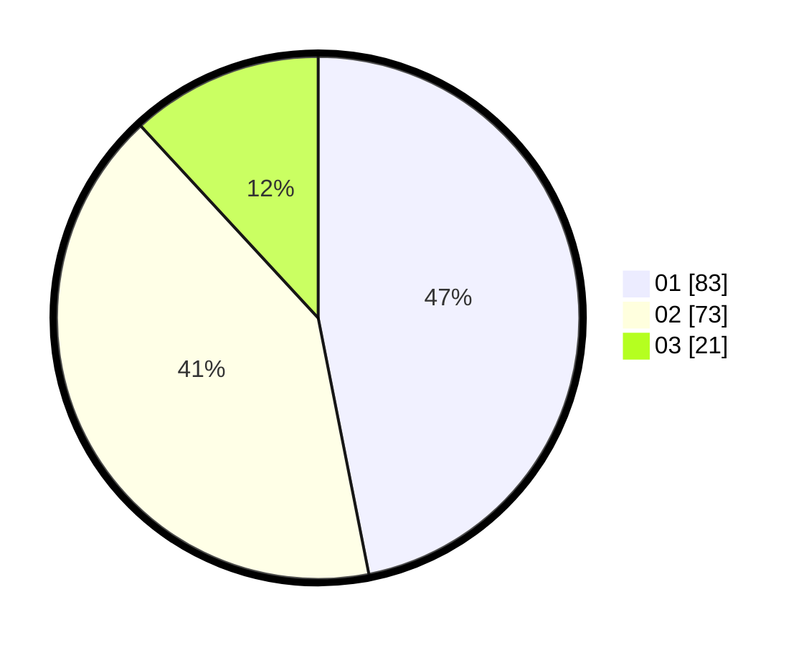

# Hasil

Hasil perolehan suara paslon dapat dilihat pada file paslon-01.txt, paslon-02.txt, dan paslon-03.txt.

Jika tidak ada, artinya data tersebut belum ada pada SIREKAP.

## Perolehan Suara

 * Paslon 01: **83**.
 * Paslon 02: **73**.
 * Paslon 03: **21**.

## Foto C Plano

https://sirekap-obj-formc.kpu.go.id/f608/pemilu/ppwp/31/72/03/10/04/3172031004060-20240214-223128--30b7a4ee-6508-4698-9449-c41f7cd3f093.jpg

https://sirekap-obj-formc.kpu.go.id/f608/pemilu/ppwp/31/72/03/10/04/3172031004060-20240214-223156--b446586d-c2f8-419d-9dad-822cb9f8515f.jpg

https://sirekap-obj-formc.kpu.go.id/f608/pemilu/ppwp/31/72/03/10/04/3172031004060-20240214-223210--10515a15-617c-4692-b207-03889d6e91f2.jpg

## DATA PEMILIH TETAP

Jumlah pemilih dalam DPT: **244**.
 * L: **123**.
 * P: **121**.

## DATA PENGGUNA HAK PILIH

Jumlah pengguna hak pilih dalam DPT: **174**.
 * L: **81**.
 * P: **93**.

Jumlah pengguna hak pilih dalam DPTb: **0**.
 * L: **0**.
 * P: **0**.

Jumlah pengguna hak pilih dalam DPK: **3**.
 * L: **2**.
 * P: **1**.

Jumlah pengguna hak pilih: **177**.
 * L: **83**.
 * P: **94**.

## JUMLAH SUARA SAH DAN TIDAK SAH

JUMLAH SELURUH SUARA SAH: **177**.

JUMLAH SUARA TIDAK SAH: **0**.

JUMLAH SELURUH SUARA SAH DAN SUARA TIDAK SAH: **177**.
