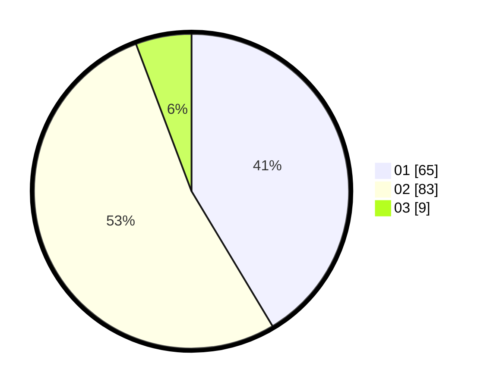

# Hasil

Hasil perolehan suara paslon dapat dilihat pada file paslon-01.txt, paslon-02.txt, dan paslon-03.txt.

Jika tidak ada, artinya data tersebut belum ada pada SIREKAP.

## Perolehan Suara

 * Paslon 01: **65**.
 * Paslon 02: **83**.
 * Paslon 03: **9**.

## Foto C Plano

https://sirekap-obj-formc.kpu.go.id/f571/pemilu/ppwp/31/72/03/10/04/3172031004061-20240215-122639--e4868d3a-e78a-46ec-bf5e-bc437bd9d9af.jpg

https://sirekap-obj-formc.kpu.go.id/f571/pemilu/ppwp/31/72/03/10/04/3172031004061-20240215-122701--29f83562-5b32-4aca-a580-de99805304e0.jpg

https://sirekap-obj-formc.kpu.go.id/f571/pemilu/ppwp/31/72/03/10/04/3172031004061-20240215-122650--84474e88-0ef6-48e2-a099-5675da1e10fc.jpg

## DATA PEMILIH TETAP

Jumlah pemilih dalam DPT: **229**.
 * L: **119**.
 * P: **110**.

## DATA PENGGUNA HAK PILIH

Jumlah pengguna hak pilih dalam DPT: **157**.
 * L: **77**.
 * P: **80**.

Jumlah pengguna hak pilih dalam DPTb: **0**.
 * L: **0**.
 * P: **0**.

Jumlah pengguna hak pilih dalam DPK: **1**.
 * L: **0**.
 * P: **1**.

Jumlah pengguna hak pilih: **158**.
 * L: **77**.
 * P: **81**.

## JUMLAH SUARA SAH DAN TIDAK SAH

JUMLAH SELURUH SUARA SAH: **157**.

JUMLAH SUARA TIDAK SAH: **1**.

JUMLAH SELURUH SUARA SAH DAN SUARA TIDAK SAH: **158**.
