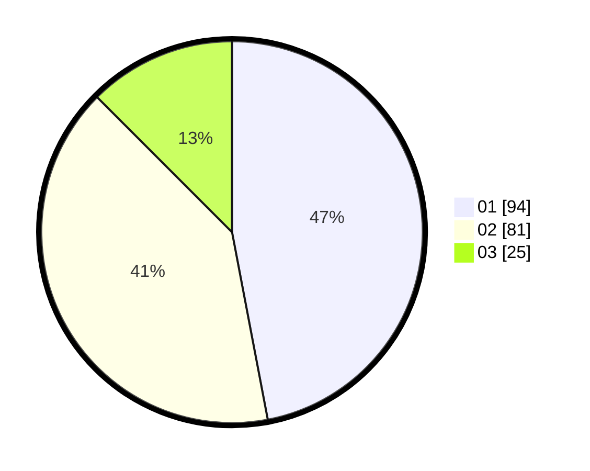

# Hasil

Hasil perolehan suara paslon dapat dilihat pada file paslon-01.txt, paslon-02.txt, dan paslon-03.txt.

Jika tidak ada, artinya data tersebut belum ada pada SIREKAP.

## Perolehan Suara

 * Paslon 01: **94**.
 * Paslon 02: **81**.
 * Paslon 03: **25**.

## Foto C Plano

https://sirekap-obj-formc.kpu.go.id/834b/pemilu/ppwp/31/72/03/10/04/3172031004062-20240214-201329--ee824f45-f4f3-4bda-9f40-f81f6a67db14.jpg

https://sirekap-obj-formc.kpu.go.id/834b/pemilu/ppwp/31/72/03/10/04/3172031004062-20240214-201513--dfc132ab-b299-44d6-b38d-db39a56e3173.jpg

https://sirekap-obj-formc.kpu.go.id/834b/pemilu/ppwp/31/72/03/10/04/3172031004062-20240214-201558--842ed6db-baca-4ae5-92e9-05f5040a5d49.jpg

## DATA PEMILIH TETAP

Jumlah pemilih dalam DPT: **276**.
 * L: **143**.
 * P: **133**.

## DATA PENGGUNA HAK PILIH

Jumlah pengguna hak pilih dalam DPT: **202**.
 * L: **99**.
 * P: **103**.

Jumlah pengguna hak pilih dalam DPTb: **0**.
 * L: **0**.
 * P: **0**.

Jumlah pengguna hak pilih dalam DPK: **1**.
 * L: **0**.
 * P: **1**.

Jumlah pengguna hak pilih: **203**.
 * L: **99**.
 * P: **104**.

## JUMLAH SUARA SAH DAN TIDAK SAH

JUMLAH SELURUH SUARA SAH: **200**.

JUMLAH SUARA TIDAK SAH: **3**.

JUMLAH SELURUH SUARA SAH DAN SUARA TIDAK SAH: **203**.
