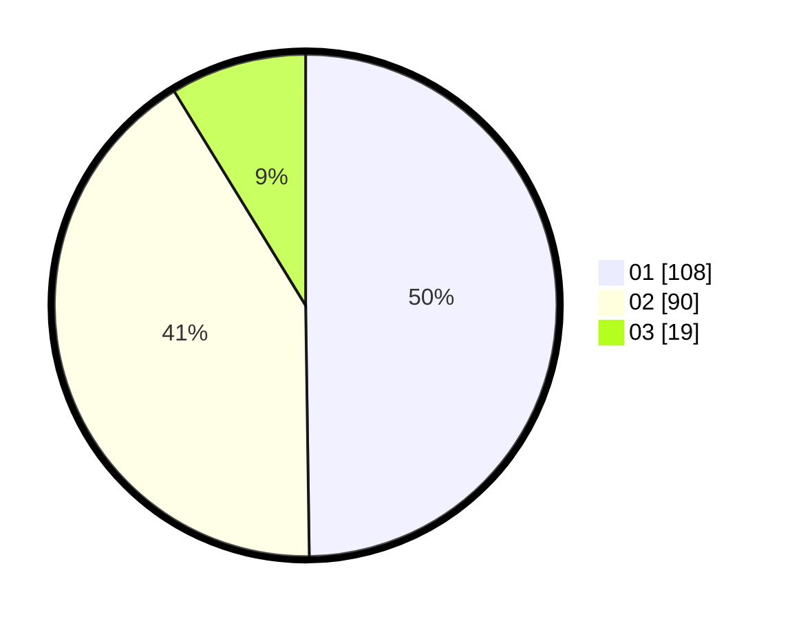

# Hasil

Hasil perolehan suara paslon dapat dilihat pada file paslon-01.txt, paslon-02.txt, dan paslon-03.txt.

Jika tidak ada, artinya data tersebut belum ada pada SIREKAP.

## Perolehan Suara

 * Paslon 01: **108**.
 * Paslon 02: **90**.
 * Paslon 03: **19**.

## Foto C Plano

https://sirekap-obj-formc.kpu.go.id/7825/pemilu/ppwp/31/72/03/10/04/3172031004063-20240216-175327--0bc6d44e-3bc9-4734-8da9-70caf12c804c.jpg

https://sirekap-obj-formc.kpu.go.id/7825/pemilu/ppwp/31/72/03/10/04/3172031004063-20240216-175329--48800e8b-a834-443e-83f6-29f7e6fcd689.jpg

https://sirekap-obj-formc.kpu.go.id/7825/pemilu/ppwp/31/72/03/10/04/3172031004063-20240216-175328--23d319a4-e292-497c-b549-c7e2f1d1b821.jpg

## DATA PEMILIH TETAP

Jumlah pemilih dalam DPT: **278**.
 * L: **145**.
 * P: **133**.

## DATA PENGGUNA HAK PILIH

Jumlah pengguna hak pilih dalam DPT: **216**.
 * L: **103**.
 * P: **113**.

Jumlah pengguna hak pilih dalam DPTb: **0**.
 * L: **0**.
 * P: **0**.

Jumlah pengguna hak pilih dalam DPK: **1**.
 * L: **0**.
 * P: **1**.

Jumlah pengguna hak pilih: **217**.
 * L: **103**.
 * P: **114**.

## JUMLAH SUARA SAH DAN TIDAK SAH

JUMLAH SELURUH SUARA SAH: **217**.

JUMLAH SUARA TIDAK SAH: **0**.

JUMLAH SELURUH SUARA SAH DAN SUARA TIDAK SAH: **217**.
