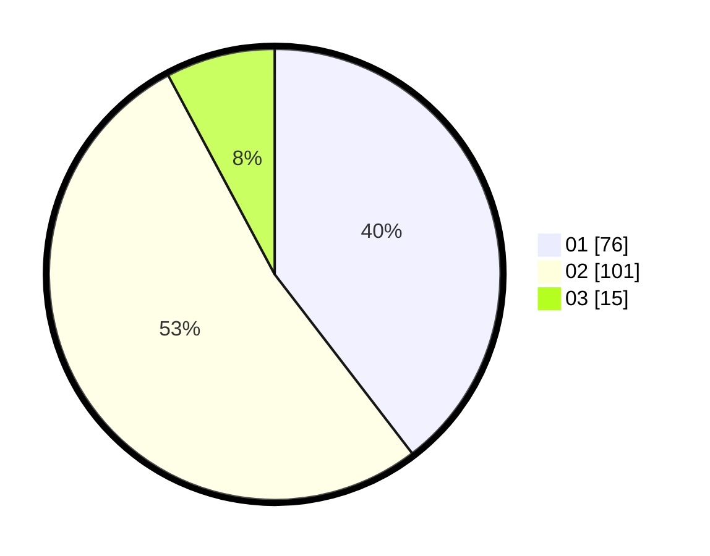

# Hasil

Hasil perolehan suara paslon dapat dilihat pada file paslon-01.txt, paslon-02.txt, dan paslon-03.txt.

Jika tidak ada, artinya data tersebut belum ada pada SIREKAP.

## Perolehan Suara

 * Paslon 01: **76**.
 * Paslon 02: **101**.
 * Paslon 03: **15**.

## Foto C Plano

https://sirekap-obj-formc.kpu.go.id/dac4/pemilu/ppwp/31/72/03/10/04/3172031004065-20240215-023435--8fb58f35-a615-4aa1-81cf-52b49a525c13.jpg

https://sirekap-obj-formc.kpu.go.id/dac4/pemilu/ppwp/31/72/03/10/04/3172031004065-20240215-023609--8b60a4a2-9dad-4b07-994c-b5d15ea4f7bd.jpg

https://sirekap-obj-formc.kpu.go.id/dac4/pemilu/ppwp/31/72/03/10/04/3172031004065-20240215-023737--75c6d8ac-ed1f-4e7f-8341-2465ac0a6fee.jpg
