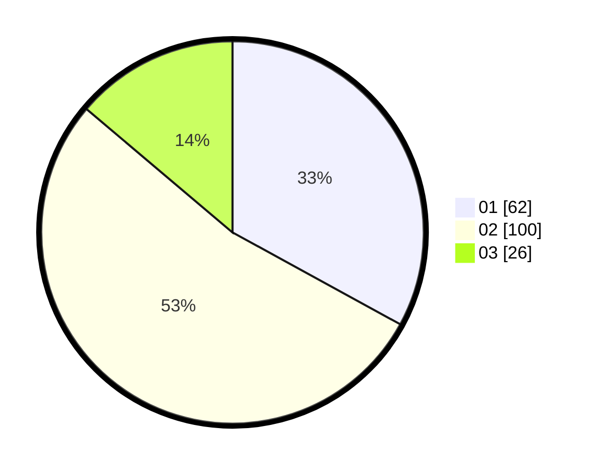

# Hasil

Hasil perolehan suara paslon dapat dilihat pada file paslon-01.txt, paslon-02.txt, dan paslon-03.txt.

Jika tidak ada, artinya data tersebut belum ada pada SIREKAP.

## Perolehan Suara

 * Paslon 01: **62**.
 * Paslon 02: **100**.
 * Paslon 03: **26**.

## Foto C Plano

https://sirekap-obj-formc.kpu.go.id/3ab6/pemilu/ppwp/31/72/03/10/04/3172031004067-20240214-201130--d202ef1b-86a4-425c-86c7-030be5299a0a.jpg

https://sirekap-obj-formc.kpu.go.id/3ab6/pemilu/ppwp/31/72/03/10/04/3172031004067-20240216-183113--90263220-9865-4e95-bdb5-c8d098e806a3.jpg

https://sirekap-obj-formc.kpu.go.id/3ab6/pemilu/ppwp/31/72/03/10/04/3172031004067-20240214-201728--bfe9c622-529b-4027-b3b8-93e5aa66af37.jpg

## DATA PEMILIH TETAP

Jumlah pemilih dalam DPT: **282**.
 * L: **148**.
 * P: **134**.

## DATA PENGGUNA HAK PILIH

Jumlah pengguna hak pilih dalam DPT: **191**.
 * L: **88**.
 * P: **103**.

Jumlah pengguna hak pilih dalam DPTb: **0**.
 * L: **0**.
 * P: **0**.

Jumlah pengguna hak pilih dalam DPK: **0**.
 * L: **0**.
 * P: **0**.

Jumlah pengguna hak pilih: **191**.
 * L: **88**.
 * P: **103**.

## JUMLAH SUARA SAH DAN TIDAK SAH

JUMLAH SELURUH SUARA SAH: **188**.

JUMLAH SUARA TIDAK SAH: **3**.

JUMLAH SELURUH SUARA SAH DAN SUARA TIDAK SAH: **191**.
