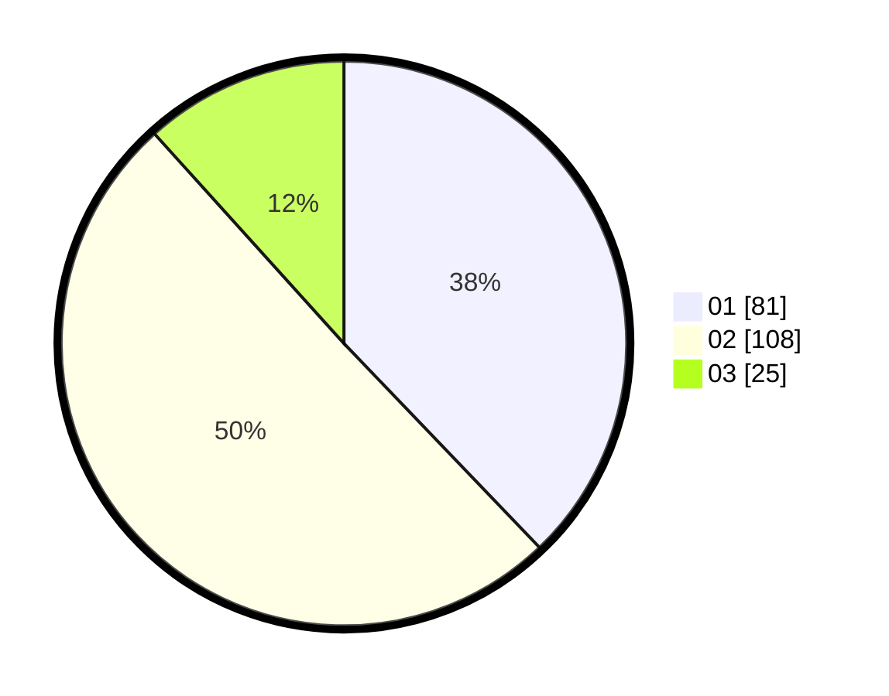

# Hasil

Hasil perolehan suara paslon dapat dilihat pada file paslon-01.txt, paslon-02.txt, dan paslon-03.txt.

Jika tidak ada, artinya data tersebut belum ada pada SIREKAP.

## Perolehan Suara

 * Paslon 01: **81**.
 * Paslon 02: **108**.
 * Paslon 03: **25**.

## Foto C Plano

https://sirekap-obj-formc.kpu.go.id/16ac/pemilu/ppwp/31/72/03/10/04/3172031004071-20240216-132512--da5c99bd-0f84-41b5-bce9-1647ddc02555.jpg

https://sirekap-obj-formc.kpu.go.id/16ac/pemilu/ppwp/31/72/03/10/04/3172031004071-20240216-132514--e5d2cf8b-6087-4cbc-90ed-8bd6db0ab0b1.jpg

https://sirekap-obj-formc.kpu.go.id/16ac/pemilu/ppwp/31/72/03/10/04/3172031004071-20240216-132513--1e74bb23-f31d-4f30-8a27-924ad45f7f3a.jpg

## DATA PEMILIH TETAP

Jumlah pemilih dalam DPT: **280**.
 * L: **141**.
 * P: **139**.

## DATA PENGGUNA HAK PILIH

Jumlah pengguna hak pilih dalam DPT: **212**.
 * L: **102**.
 * P: **110**.

Jumlah pengguna hak pilih dalam DPTb: **0**.
 * L: **0**.
 * P: **0**.

Jumlah pengguna hak pilih dalam DPK: **6**.
 * L: **3**.
 * P: **3**.

Jumlah pengguna hak pilih: **218**.
 * L: **105**.
 * P: **113**.

## JUMLAH SUARA SAH DAN TIDAK SAH

JUMLAH SELURUH SUARA SAH: **214**.

JUMLAH SUARA TIDAK SAH: **4**.

JUMLAH SELURUH SUARA SAH DAN SUARA TIDAK SAH: **218**.
