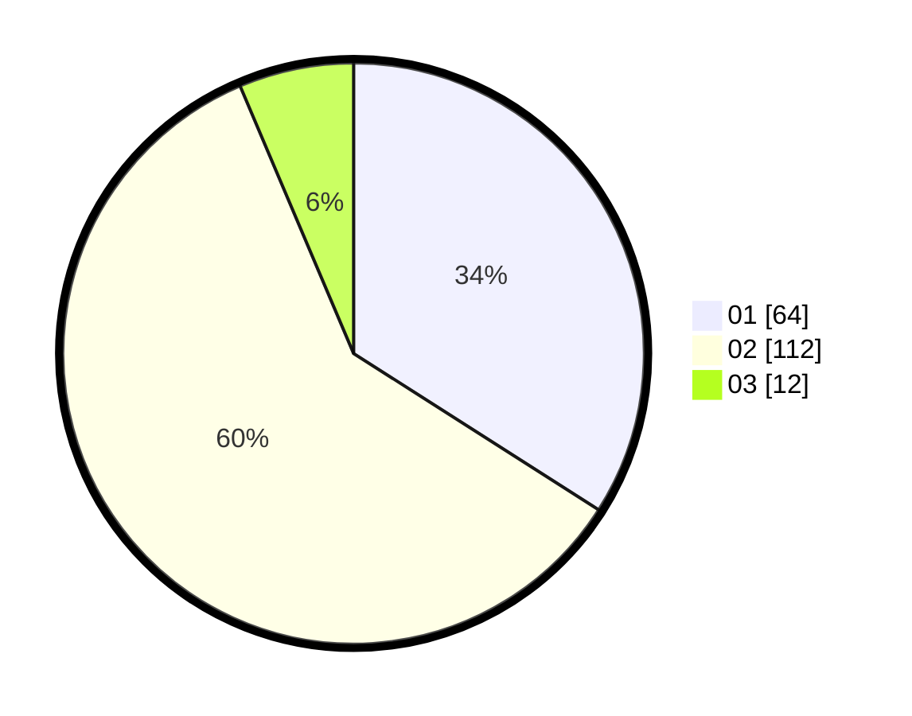

# Hasil

Hasil perolehan suara paslon dapat dilihat pada file paslon-01.txt, paslon-02.txt, dan paslon-03.txt.

Jika tidak ada, artinya data tersebut belum ada pada SIREKAP.

## Perolehan Suara

 * Paslon 01: **64**.
 * Paslon 02: **112**.
 * Paslon 03: **12**.

## Foto C Plano

https://sirekap-obj-formc.kpu.go.id/abd6/pemilu/ppwp/31/72/03/10/04/3172031004072-20240216-180519--60a08553-d4ac-4aee-9ed1-131dcb3fb85c.jpg

https://sirekap-obj-formc.kpu.go.id/abd6/pemilu/ppwp/31/72/03/10/04/3172031004072-20240216-180520--88254225-c680-43ef-862f-ce87869ba434.jpg

https://sirekap-obj-formc.kpu.go.id/abd6/pemilu/ppwp/31/72/03/10/04/3172031004072-20240216-180520--6827dd57-799d-47b4-9379-f4a8a8af630c.jpg

## DATA PEMILIH TETAP

Jumlah pemilih dalam DPT: **291**.
 * L: **150**.
 * P: **141**.

## DATA PENGGUNA HAK PILIH

Jumlah pengguna hak pilih dalam DPT: **189**.
 * L: **102**.
 * P: **87**.

Jumlah pengguna hak pilih dalam DPTb: **0**.
 * L: **0**.
 * P: **0**.

Jumlah pengguna hak pilih dalam DPK: **4**.
 * L: **3**.
 * P: **1**.

Jumlah pengguna hak pilih: **193**.
 * L: **105**.
 * P: **88**.

## JUMLAH SUARA SAH DAN TIDAK SAH

JUMLAH SELURUH SUARA SAH: **188**.

JUMLAH SUARA TIDAK SAH: **5**.

JUMLAH SELURUH SUARA SAH DAN SUARA TIDAK SAH: **193**.
