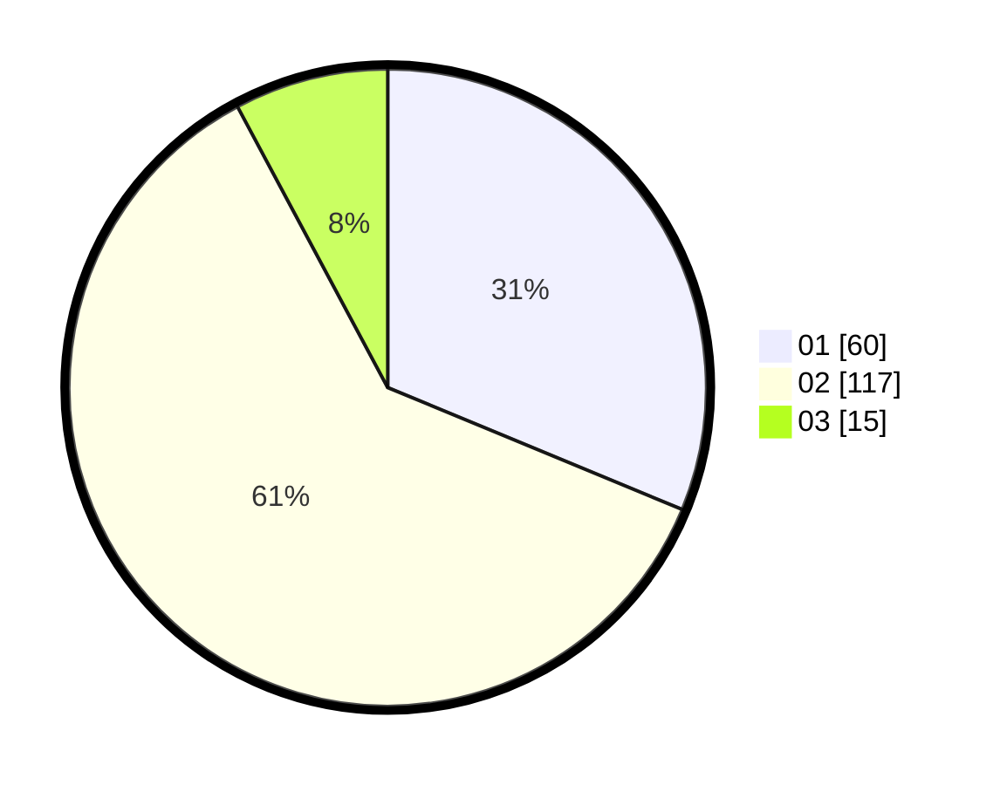

# Hasil

Hasil perolehan suara paslon dapat dilihat pada file paslon-01.txt, paslon-02.txt, dan paslon-03.txt.

Jika tidak ada, artinya data tersebut belum ada pada SIREKAP.

## Perolehan Suara

 * Paslon 01: **60**.
 * Paslon 02: **117**.
 * Paslon 03: **15**.

## Foto C Plano

https://sirekap-obj-formc.kpu.go.id/2012/pemilu/ppwp/31/72/03/10/04/3172031004073-20240214-191736--e86d832c-348b-443b-b2d3-3d98af7c3d5c.jpg

https://sirekap-obj-formc.kpu.go.id/2012/pemilu/ppwp/31/72/03/10/04/3172031004073-20240214-191830--cf69edc2-c230-4549-a908-bc3a6a71414b.jpg

https://sirekap-obj-formc.kpu.go.id/2012/pemilu/ppwp/31/72/03/10/04/3172031004073-20240214-195513--ee2f4460-d7bd-41fc-813d-e68317dfbe48.jpg

## DATA PEMILIH TETAP

Jumlah pemilih dalam DPT: **292**.
 * L: **148**.
 * P: **144**.

## DATA PENGGUNA HAK PILIH

Jumlah pengguna hak pilih dalam DPT: **187**.
 * L: **95**.
 * P: **92**.

Jumlah pengguna hak pilih dalam DPTb: **0**.
 * L: **0**.
 * P: **0**.

Jumlah pengguna hak pilih dalam DPK: **7**.
 * L: **3**.
 * P: **4**.

Jumlah pengguna hak pilih: **194**.
 * L: **98**.
 * P: **96**.

## JUMLAH SUARA SAH DAN TIDAK SAH

JUMLAH SELURUH SUARA SAH: **192**.

JUMLAH SUARA TIDAK SAH: **2**.

JUMLAH SELURUH SUARA SAH DAN SUARA TIDAK SAH: **194**.
