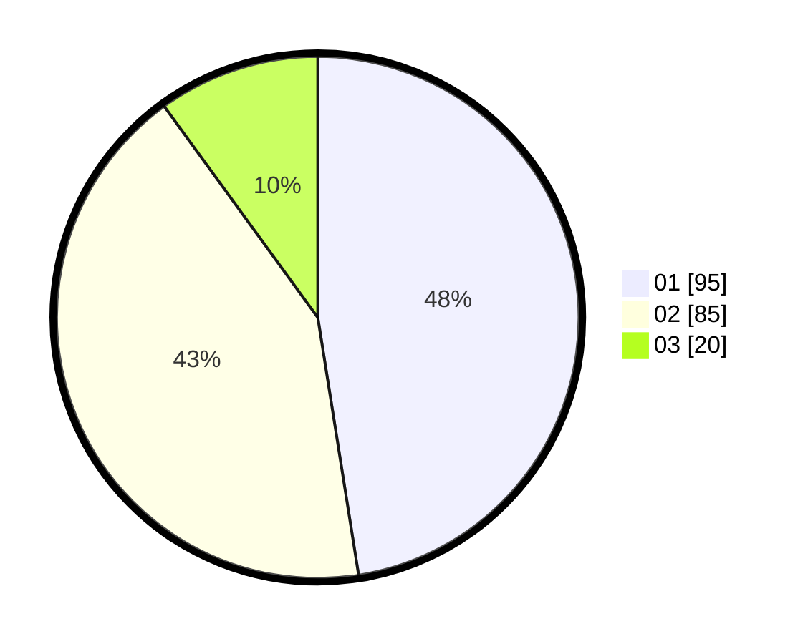

# Hasil

Hasil perolehan suara paslon dapat dilihat pada file paslon-01.txt, paslon-02.txt, dan paslon-03.txt.

Jika tidak ada, artinya data tersebut belum ada pada SIREKAP.

## Perolehan Suara

 * Paslon 01: **95**.
 * Paslon 02: **85**.
 * Paslon 03: **20**.

## Foto C Plano

https://sirekap-obj-formc.kpu.go.id/de47/pemilu/ppwp/31/72/03/10/04/3172031004074-20240214-222935--3edc9936-cd25-44f9-8d38-0858c45dceab.jpg

https://sirekap-obj-formc.kpu.go.id/de47/pemilu/ppwp/31/72/03/10/04/3172031004074-20240214-223000--6d5229c4-189e-4c34-a564-8de8d7932362.jpg

https://sirekap-obj-formc.kpu.go.id/de47/pemilu/ppwp/31/72/03/10/04/3172031004074-20240214-215857--f194c272-9572-47ea-9d74-e703ff5b29d0.jpg

## DATA PEMILIH TETAP

Jumlah pemilih dalam DPT: **293**.
 * L: **156**.
 * P: **137**.

## DATA PENGGUNA HAK PILIH

Jumlah pengguna hak pilih dalam DPT: **201**.
 * L: **107**.
 * P: **94**.

Jumlah pengguna hak pilih dalam DPTb: **0**.
 * L: **0**.
 * P: **0**.

Jumlah pengguna hak pilih dalam DPK: **0**.
 * L: **0**.
 * P: **0**.

Jumlah pengguna hak pilih: **201**.
 * L: **107**.
 * P: **94**.

## JUMLAH SUARA SAH DAN TIDAK SAH

JUMLAH SELURUH SUARA SAH: **200**.

JUMLAH SUARA TIDAK SAH: **1**.

JUMLAH SELURUH SUARA SAH DAN SUARA TIDAK SAH: **201**.
